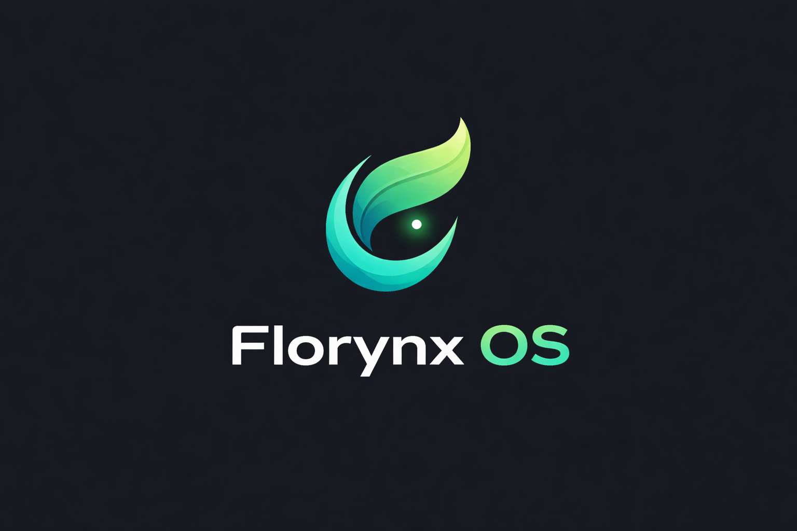

<p align="center">
  
</p>

<p align="center">
  <strong>A bioluminescent desktop OS built from scratch in Rust.</strong><br>
  <em>KDE Plasma-inspired shell • Double-buffered compositor • Capability security</em>
</p>

<p align="center">
  
  
  
  
</p>

---

## Overview

FlorynxOS is a modern x86_64 operating system with a **KDE Plasma-inspired desktop shell**, written entirely in Rust (`#![no_std]`). It boots from bare metal into a dark bioluminescent GUI with animated windows, a bottom panel with app menu, and a double-buffered compositor — all rendered on a raw framebuffer.

**v0.3.0 "Sentinel"** introduces kernel/userland separation, an animation engine, per-window compositor buffers, capability-based security, and 3 default wallpapers.

## Architecture

```
florynx-os/
├── florynx-kernel/          Kernel (Ring 0)
│   └── src/
│       ├── arch/x86_64/     GDT, IDT, PIC, PIT, syscall entry
│       ├── core/            Kernel core, panic, logging
│       ├── drivers/         Display (double-buffered), input, serial, timer
│       ├── memory/          Paging, frame alloc, 16 MiB heap
│       ├── gui/             Animated compositor, 32-rect dirty engine
│       ├── process/         Scheduler, tasks, context switch
│       ├── syscall/         Syscall dispatch (11 syscalls)
│       ├── ipc/             Channels, messages, event bus
│       ├── fs/              VFS, tmpfs, devfs, ramdisk
│       └── security/        18 capabilities, audit log
│
├── florynx-userland/        Userland (future Ring 3)
│   ├── src/
│   │   ├── gui/             KDE Plasma-style desktop shell
│   │   │   ├── shell.rs     Desktop compositor
│   │   │   ├── panel.rs     Bottom panel (menu + taskbar + systray)
│   │   │   ├── app_menu.rs  Kickoff-style app launcher
│   │   │   ├── taskbar.rs   Window list / task manager
│   │   │   ├── systray.rs   Clock, indicators
│   │   │   ├── wallpaper.rs Wallpaper manager (3 defaults)
│   │   │   └── theme.rs     Breeze Bioluminescent theme
│   │   ├── apps/            Files, Terminal, Settings, Monitor, Editor
│   │   └── system/          Session manager, notification daemon
│   └── assets/
│       └── wallpapers/      3 default bioluminescent wallpapers
│
├── shared/                  Kernel ↔ Userland shared types
│   └── src/
│       ├── syscall_abi.rs   Syscall numbers + error codes
│       └── types.rs         Rect, Color, GuiEvent, WindowParams
│
└── docs/                    Architecture docs, evolution log
```

## Default Wallpapers

Three bioluminescent wallpapers ship with FlorynxOS:

| # | Name | Description |
|---|------|-------------|
| 1 | Bioluminescent Crystals | Green & cyan crystal formations |
| 2 | Flowing Waves | Abstract teal energy waves |
| 3 | Nebula | Green-cyan cosmic nebula |

## Prerequisites

- **Rust nightly** (auto-configured via `rust-toolchain.toml`)
- **QEMU** (`qemu-system-x86_64`)
- **bootimage**: `cargo install bootimage`

## Build & Run

```bash
cd florynx-kernel
cargo +nightly bootimage
qemu-system-x86_64 \
  -drive format=raw,file=target/x86_64-florynx/debug/bootimage-florynx-kernel.bin \
  -serial stdio -m 128
```

## Features (108 total across 7 phases)

### Kernel
- x86_64 bare-metal, GDT+TSS, IDT with 9 exception handlers
- PIC interrupts, PIT at 200 Hz
- 4-level paging, O(1) frame allocator
- **16 MiB** kernel heap (linked-list allocator)
- PS/2 keyboard + mouse (timeout-safe)
- Serial debug (UART 16550, COM1)
- Round-robin scheduler with task exit()
- Syscall interface (11 syscalls)
- VFS + tmpfs + devfs (/dev/null, /dev/zero, /dev/serial0)
- Ramdisk (4 MiB)
- **18 capability flags** with enforcement + audit log

### GUI Compositor
- **Double-buffered** rendering (RAM back buffer → VRAM flush)
- **32-rect dirty engine** with merge (no full-screen redraws)
- **Animation engine**: LERP, ease_out, AnimatedPos/Opacity/Scale
- **Per-window offscreen buffers** with dirty flag
- Animated window drag (smooth interpolation)
- Window fade-in on creation
- **Dock hover magnification** (1.25× animated scale)
- BGA framebuffer (1024×768, 32bpp)
- Cursor: back-buffer draw, flush ~14×20 region only

### KDE Plasma-Style Shell (Userland)
- Bottom panel: [App Menu] [Taskbar] [System Tray + Clock]
- Kickoff-style application launcher
- Task manager with active window highlighting
- System tray with clock display
- Wallpaper manager (3 default wallpapers)
- Breeze Bioluminescent dark theme
- Notification daemon (top-right popups)
- Built-in apps: Files, Terminal, Settings, Monitor, Editor

### IPC
- Bidirectional typed channels
- Message queue (mailbox pattern)
- Event bus: pub/sub with 64-entry ring buffers (32 subscriptions)

## Boot Sequence

```
Phase 1  GDT → IDT → PIC + PIT              [arch]
Phase 2  Paging → Frame alloc → Heap (16 MiB) [memory]
Phase 3  BGA framebuffer → Console → Mouse    [drivers]
Phase 4  Enable interrupts                     [arch]
Phase 5  VFS + DevFS + Scheduler + Syscalls    [services]
Phase 6  Desktop launch → hlt_loop            [gui]
```

### Serial Output (v0.3.0)
```
[gdt] loaded with kernel segments and TSS
[idt] loaded with exception and IRQ handlers
[heap] initialized at 0x444444440000, size 16384 KiB
[vfs] initialized with 5 directories
[devfs] initialized: /dev/null, /dev/zero, /dev/serial0
[syscall] interface initialized (11 syscalls registered)
[desktop] GUI initialized (1024x768)
```

## Documentation

- **[Architecture](docs/architecture.md)** — Full system architecture with Mermaid diagrams
- **[Evolutions](docs/evolutions.md)** — All 108 features tracked across 7 phases
- **[Release Notes](RELEASE_v0.3.0.md)** — v0.3.0 "Sentinel" changelog

## License

This project is part of the Florynx OS initiative by [Florynx Labs](https://github.com/Florynx-labs).
