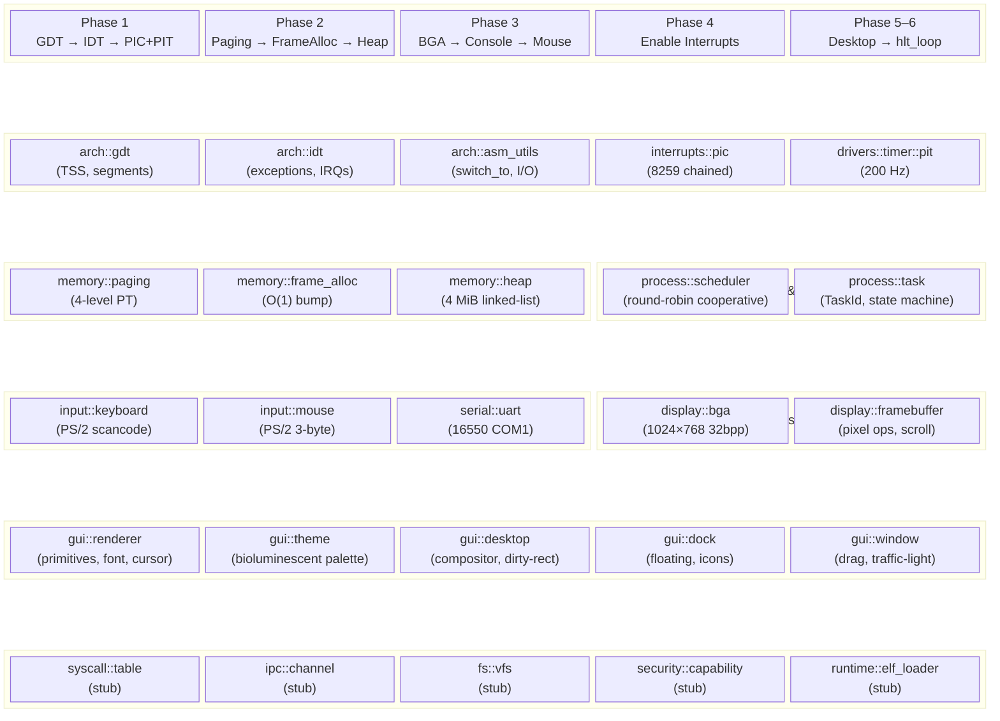
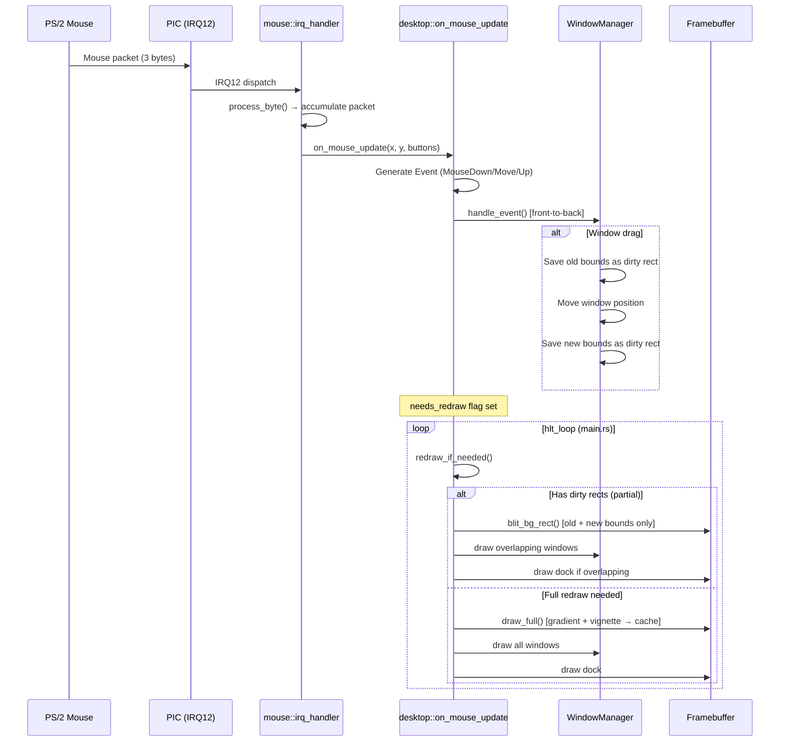
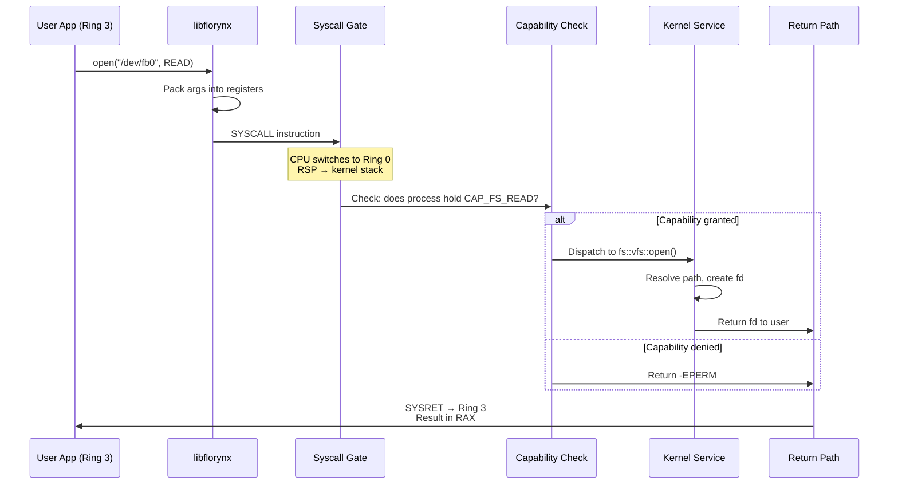
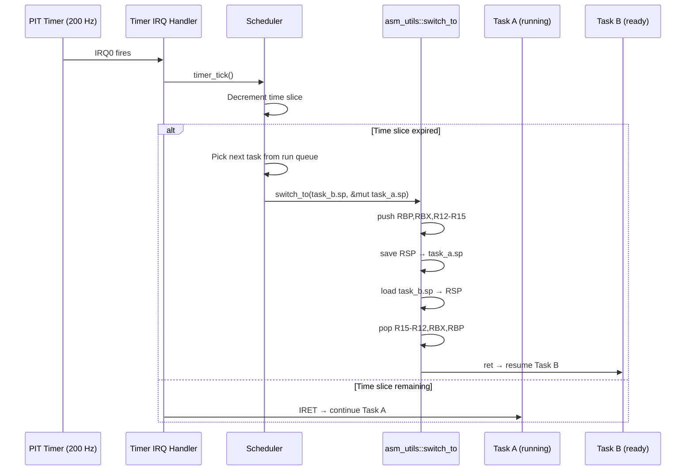

<p align="center"><strong>Florynx‑OS — System Architecture</strong></p>
<p align="center">v0.2 → vNext Scalability Blueprint</p>

---

# 1. Current State (v0.2) — What Exists Today

Everything below the dashed line is **working and must not be broken**.



### Current Module Inventory

| Module | Files | Status | Description |
|--------|-------|--------|-------------|
| `arch::x86_64::gdt` | gdt.rs | ✅ Working | GDT with TSS, kernel+user segments |
| `arch::x86_64::idt` | idt.rs | ✅ Working | IDT with exception + IRQ handlers |
| `arch::x86_64::asm_utils` | asm_utils.rs | ✅ Working | Context switch, I/O ports, interrupt control, GDT/IDT load |
| `arch::x86_64::cpu` | cpu.rs | ✅ Working | CPUID, vendor string, halt |
| `interrupts::pic` | pic.rs | ✅ Working | 8259A chained PIC |
| `drivers::timer::pit` | pit.rs | ✅ Working | 8254 PIT at 200 Hz |
| `drivers::input::keyboard` | keyboard.rs | ✅ Working | PS/2 scancode → ASCII |
| `drivers::input::mouse` | mouse.rs | ✅ Working | PS/2 3-byte protocol, timeout-safe |
| `drivers::serial::uart` | uart.rs | ✅ Working | UART 16550 on COM1 |
| `drivers::display::bga` | bga.rs | ✅ Working | Bochs VBE, 1024×768×32 |
| `drivers::display::framebuffer` | framebuffer.rs | ✅ Working | Raw pixel ops, RGB/BGR/U8 |
| `memory::paging` | paging.rs | ✅ Working | 4-level page table, identity-mapped |
| `memory::frame_allocator` | frame_allocator.rs | ✅ Working | O(1) bump allocator |
| `memory::heap` | heap.rs | ✅ Working | 4 MiB linked-list allocator |
| `process::scheduler` | scheduler.rs | ✅ Working | Cooperative round-robin |
| `process::task` | task.rs | ✅ Working | Task struct, user-mode jump |
| `process::context` | context.rs | ✅ Working | CpuContext (all GPRs + segments) |
| `gui::renderer` | renderer.rs | ✅ Working | Draw primitives, font, cursor |
| `gui::theme` | theme.rs | ✅ Working | PRD bioluminescent palette |
| `gui::desktop` | desktop.rs | ✅ Working | Compositor, dirty-rect engine, WM |
| `gui::window` | window.rs | ✅ Working | Draggable, shadow, traffic-light |
| `gui::dock` | dock.rs | ✅ Working | Floating dock, bitmap icons |
| `gui::console` | console.rs | ✅ Working | Early-boot framebuffer text |
| `gui::event` | event.rs | ✅ Working | Rect, mouse events |
| `gui::icons` | icons.rs | ✅ Working | 16×16 + 8×8 monochrome bitmaps |
| `core_kernel::kernel` | kernel.rs | ✅ Working | post_init, CPU info |
| `core_kernel::logging` | logging.rs | ✅ Working | serial_print!, println! macros |
| `core_kernel::panic` | panic.rs | ✅ Working | Panic handler with serial output |
| `time::clock` | clock.rs | ✅ Working | System clock init |
| `syscall` | table.rs, handlers.rs | 🟡 Stub | Syscall table placeholder |
| `ipc` | message.rs, channel.rs | 🟡 Stub | IPC message passing placeholder |
| `fs` | vfs.rs, inode.rs, mount.rs | 🟡 Stub | VFS placeholder |
| `security` | capability.rs, isolation.rs | 🟡 Stub | Capability system placeholder |
| `runtime` | elf_loader, process_spawn | 🟡 Stub | ELF loader placeholder |
| `wincompat` | win32, dll_loader, directx | 🟡 Stub | Windows compat placeholder |

---

# 2. Target Architecture — Scalable Florynx‑OS

The following diagram shows the full target architecture. **Solid borders** = currently implemented. **Dashed borders** = planned. Communication arrows show data/control flow direction.

```mermaid
graph TB
    subgraph USERSPACE["<b>🌐 USER SPACE (Ring 3)</b>"]
        direction TB
        APP1["📁 File Manager"]
        APP2["💻 Terminal"]
        APP3["⚙️ Settings"]
        APP4["📝 Text Editor"]
        APP5["🌐 Browser<br/><i>future</i>"]
        SHELL["🐚 Florynx Shell<br/>(CLI + scripting)"]
        LIBFX["libflorynx.so<br/>(userspace syscall lib)"]
    end

    subgraph SYSCALL_LAYER["<b>🔐 SYSCALL BARRIER (Ring 0 ↔ Ring 3)</b>"]
        direction LR
        SYSCALL["syscall::table<br/>SYSCALL/SYSRET dispatch"]
        CAP_CHECK["security::capability<br/>Capability gate check"]
    end

    subgraph KERNEL["<b>⚙️ KERNEL SPACE (Ring 0)</b>"]
        direction TB

        subgraph CORE["<b>Kernel Core</b>"]
            direction LR
            GDT2["arch::gdt<br/>GDT + TSS"]
            IDT2["arch::idt<br/>IDT + handlers"]
            ASM2["arch::asm_utils<br/>switch_to, I/O, cli/sti"]
            INTR["interrupts::pic<br/>IRQ dispatch"]
        end

        subgraph SCHED_SUBSYS["<b>Scheduler Subsystem</b>"]
            direction LR
            SCHED2["scheduler::core<br/>Per-CPU run queues"]
            PREEMPT["scheduler::preempt<br/>Timer-tick preemption"]
            AFFINITY["scheduler::affinity<br/>CPU pinning"]
            LOAD_BAL["scheduler::balance<br/>Work stealing"]
        end

        subgraph MEM_SUBSYS["<b>Memory Subsystem</b>"]
            direction LR
            PMM["memory::frame_alloc<br/>Physical frame allocator"]
            VMM["memory::paging<br/>Virtual memory manager"]
            HEAP2["memory::heap<br/>Kernel heap (slab future)"]
            MMAP["memory::mmap<br/>User mmap / shared mem"]
        end

        subgraph IPC_SUBSYS["<b>IPC / Message Bus</b>"]
            direction LR
            CHAN["ipc::channel<br/>Typed channels"]
            MSGBUS["ipc::message_bus<br/>Async pub/sub"]
            SHMEM["ipc::shared_mem<br/>Zero-copy regions"]
            SIGNAL["ipc::signal<br/>POSIX-like signals"]
        end

        subgraph FS_SUBSYS["<b>Filesystem Subsystem</b>"]
            direction LR
            VFS2["fs::vfs<br/>Virtual FS layer"]
            TMPFS["fs::tmpfs<br/>In-memory FS"]
            DEVFS["fs::devfs<br/>/dev node mapping"]
            FATFS["fs::fat32<br/>FAT32 driver"]
            EXT["fs::ext2<br/><i>future</i>"]
        end

        subgraph DRV_SUBSYS["<b>Driver Framework</b>"]
            direction LR
            DRVMGR["drivers::manager<br/>Registry + hotplug"]
            PCI["drivers::pci<br/>PCI enumeration"]
            BLK["drivers::block<br/>Block device trait"]
            NIC["drivers::net<br/><i>future: virtio-net</i>"]
        end

        subgraph DRV_HW["<b>Hardware Drivers</b>"]
            direction LR
            PS2K["input::keyboard<br/>PS/2"]
            PS2M["input::mouse<br/>PS/2"]
            UART2["serial::uart<br/>COM1"]
            PIT2["timer::pit<br/>200 Hz"]
            BGA2["display::bga<br/>Bochs VBE"]
            FBUF["display::framebuffer<br/>Pixel ops"]
        end

        subgraph GUI_SUBSYS["<b>GUI Subsystem (Compositor)</b>"]
            direction LR
            EVBUS["gui::event_bus<br/>Async event dispatch"]
            RENDER2["gui::renderer<br/>Draw primitives"]
            COMP["gui::desktop<br/>Compositor + dirty-rect"]
            WM2["gui::window<br/>Window manager"]
            DOCK2["gui::dock<br/>Dock bar"]
            LAUNCH["gui::launcher<br/><i>future: app grid</i>"]
            WIDGETS["gui::widgets<br/><i>future: buttons, text</i>"]
        end

        subgraph SEC_SUBSYS["<b>Security Subsystem</b>"]
            direction LR
            CAPS["security::capability<br/>Capability tokens"]
            SANDBOX["security::sandbox<br/>Process isolation"]
            AUDIT["security::audit<br/>Security event log"]
        end
    end

    subgraph HARDWARE["<b>🔩 HARDWARE</b>"]
        direction LR
        CPU["x86_64 CPU<br/>(AMD64)"]
        RAM["Physical RAM"]
        DISK["Storage<br/><i>future: virtio-blk</i>"]
        GPU["BGA / VBE<br/>Framebuffer"]
        KBD2["PS/2 Keyboard"]
        MOUSE2["PS/2 Mouse"]
        COM["COM1 Serial"]
        NET_HW["NIC<br/><i>future: virtio</i>"]
    end

    %% ===== USER → SYSCALL =====
    APP1 & APP2 & APP3 & APP4 & SHELL --> LIBFX
    LIBFX -->|"syscall"| SYSCALL

    %% ===== SYSCALL → KERNEL =====
    SYSCALL -->|"cap check"| CAP_CHECK
    CAP_CHECK -->|"dispatch"| SCHED2
    CAP_CHECK -->|"dispatch"| FS_SUBSYS
    CAP_CHECK -->|"dispatch"| IPC_SUBSYS
    CAP_CHECK -->|"dispatch"| MEM_SUBSYS

    %% ===== SCHEDULER =====
    SCHED2 --> PREEMPT
    PREEMPT -->|"timer IRQ"| PIT2
    SCHED2 -->|"switch_to()"| ASM2
    SCHED2 --> LOAD_BAL

    %% ===== MEMORY =====
    VMM --> PMM
    HEAP2 --> PMM
    MMAP --> VMM

    %% ===== IPC =====
    CHAN --> SHMEM
    MSGBUS --> CHAN
    SIGNAL --> SCHED2

    %% ===== FS =====
    VFS2 --> TMPFS & DEVFS & FATFS
    VFS2 -->|"block I/O"| BLK

    %% ===== DRIVERS =====
    DRVMGR --> PCI
    DRVMGR --> BLK & NIC
    PCI --> BGA2

    %% ===== GUI =====
    EVBUS -->|"mouse/kbd events"| COMP
    COMP --> WM2 & DOCK2
    WM2 --> RENDER2
    DOCK2 --> RENDER2
    RENDER2 --> FBUF
    FBUF --> GPU
    PS2K -->|"IRQ1"| EVBUS
    PS2M -->|"IRQ12"| EVBUS

    %% ===== HW connections =====
    INTR --> PS2K & PS2M & PIT2 & UART2
    PMM --> RAM
    UART2 --> COM
    BLK --> DISK

    %% ===== Styling =====
    classDef working fill:#0d4429,stroke:#29D3D0,color:#F3F7FA,stroke-width:2px
    classDef stub fill:#1B2330,stroke:#6EF0A2,color:#A8B6C6,stroke-width:1px,stroke-dasharray: 5 5
    classDef future fill:#161D29,stroke:#D9FF72,color:#6B7280,stroke-width:1px,stroke-dasharray: 8 4
    classDef barrier fill:#2B1A1A,stroke:#F26D6D,color:#F3F7FA,stroke-width:2px
    classDef hw fill:#0D1117,stroke:#555,color:#888,stroke-width:1px

    class GDT2,IDT2,ASM2,INTR,SCHED2,PMM,VMM,HEAP2,PS2K,PS2M,UART2,PIT2,BGA2,FBUF,RENDER2,COMP,WM2,DOCK2,CAPS working
    class PREEMPT,AFFINITY,LOAD_BAL,MMAP,CHAN,MSGBUS,SHMEM,SIGNAL,VFS2,TMPFS,DEVFS,FATFS,DRVMGR,PCI,BLK,EVBUS,SANDBOX,AUDIT,SYSCALL,CAP_CHECK,LIBFX,SHELL stub
    class APP1,APP2,APP3,APP4,APP5,EXT,NIC,LAUNCH,WIDGETS future
    class CPU,RAM,DISK,GPU,KBD2,MOUSE2,COM,NET_HW hw
```



**Legend:**
- 🟢 **Solid green border** = Currently implemented and working
- 🟢 **Dashed green border** = Stub exists, needs implementation
- 🟡 **Dashed yellow border** = Future planned, no code yet
- 🔴 **Red border** = Security barrier (syscall/capability gate)

---

# 3. Layered Architecture View

```
┌─────────────────────────────────────────────────────────────────────────┐
│                         USER SPACE (Ring 3)                             │
│                                                                         │
│  ┌──────────┐ ┌──────────┐ ┌──────────┐ ┌──────────┐ ┌──────────┐     │
│  │ Terminal  │ │ Files    │ │ Settings │ │ Editor   │ │ Browser  │     │
│  └────┬─────┘ └────┬─────┘ └────┬─────┘ └────┬─────┘ └────┬─────┘     │
│       └─────────────┴─────────────┴─────────────┴───────────┘           │
│                              │                                          │
│                    ┌─────────▼──────────┐                               │
│                    │   libflorynx.so    │  ← Userspace syscall library  │
│                    │  (safe Rust API)   │                               │
│                    └─────────┬──────────┘                               │
╞═════════════════════════════ SYSCALL ═══════════════════════════════════╡
│                    ┌─────────▼──────────┐                               │
│                    │  Capability Gate   │  ← Every syscall checked      │
│                    └─────────┬──────────┘                               │
│                         KERNEL (Ring 0)                                 │
│                                                                         │
│  ┌───────────────────────────────────────────────────────────────────┐  │
│  │                    KERNEL SERVICES LAYER                          │  │
│  │                                                                   │  │
│  │  ┌────────────┐  ┌────────────┐  ┌────────────┐  ┌────────────┐ │  │
│  │  │ Scheduler  │  │    IPC     │  │    VFS     │  │  Security  │ │  │
│  │  │            │  │            │  │            │  │            │ │  │
│  │  │ • per-CPU  │  │ • channels │  │ • tmpfs    │  │ • caps     │ │  │
│  │  │   queues   │  │ • msg bus  │  │ • devfs    │  │ • sandbox  │ │  │
│  │  │ • preempt  │  │ • signals  │  │ • fat32    │  │ • audit    │ │  │
│  │  │ • balance  │  │ • shmem   │  │ • ext2     │  │            │ │  │
│  │  └─────┬──────┘  └─────┬──────┘  └─────┬──────┘  └────────────┘ │  │
│  └────────┼───────────────┼───────────────┼─────────────────────────┘  │
│           │               │               │                             │
│  ┌────────▼───────────────▼───────────────▼─────────────────────────┐  │
│  │                    KERNEL CORE LAYER                              │  │
│  │                                                                   │  │
│  │  ┌──────────┐ ┌──────────┐ ┌──────────┐ ┌──────────────────────┐ │  │
│  │  │  Memory  │ │ Interrupt│ │  Timer   │ │  Arch (GDT/IDT/ASM) │ │  │
│  │  │  Manager │ │ Dispatch │ │  (PIT)   │ │  context switch      │ │  │
│  │  └────┬─────┘ └────┬─────┘ └────┬─────┘ └──────────────────────┘ │  │
│  └───────┼─────────────┼────────────┼───────────────────────────────┘  │
│          │             │            │                                   │
│  ┌───────▼─────────────▼────────────▼───────────────────────────────┐  │
│  │                    DRIVER FRAMEWORK                               │  │
│  │                                                                   │  │
│  │  ┌─────────┐ ┌─────────┐ ┌──────────┐ ┌────────┐ ┌────────────┐ │  │
│  │  │Keyboard │ │ Mouse   │ │ Display  │ │ Serial │ │ Block Dev  │ │  │
│  │  │ (PS/2)  │ │ (PS/2)  │ │ (BGA+FB) │ │ (UART) │ │ (future)  │ │  │
│  │  └────┬────┘ └────┬────┘ └────┬─────┘ └───┬────┘ └─────┬──────┘ │  │
│  └───────┼──────────-─┼──────────-┼───────────┼────────────┼────────┘  │
│          │            │           │           │            │            │
│  ┌───────▼─────────── ▼───────────▼───────────▼────────────▼────────┐  │
│  │                    GUI COMPOSITOR                                 │  │
│  │                                                                   │  │
│  │  Event Bus ──→ Desktop (dirty-rect) ──→ Windows ──→ Renderer     │  │
│  │                    │                        │           │          │  │
│  │                    └── Dock ─────── Icons ──┘     Framebuffer     │  │
│  └───────────────────────────────────────────────────────────────────┘  │
╞═════════════════════════════════════════════════════════════════════════╡
│                          HARDWARE                                      │
│  CPU (x86_64) │ RAM │ BGA/VBE │ PS/2 │ COM1 │ PCI │ Storage │ NIC    │
└─────────────────────────────────────────────────────────────────────────┘
```

---

# 4. Communication Flow Diagrams

## 4.1 Interrupt → GUI Event Flow (Current, Working)



## 4.2 Future Syscall Flow (Planned)



## 4.3 Future Preemptive Scheduler Flow (Planned)



---

# 5. Module Legends & Scalability Notes

## 5.1 Kernel Core (`arch::x86_64`)

| Component | Current | Scaling Path |
|-----------|---------|-------------|
| **GDT** | Kernel code/data + TSS + user segments | Add per-CPU GDTs for SMP. Each CPU gets its own TSS with separate IST stacks. |
| **IDT** | Shared IDT, 256 vectors | Shared across CPUs (IDT is read-only). Add APIC-routed vectors per core. |
| **asm_utils** | switch_to, outb/inb, cli/sti, lgdt | Core foundation. Add `swapgs` for user↔kernel transitions. Add `wrmsr`/`rdmsr` for SYSCALL setup. |
| **PIC** | 8259A chained, 15 IRQs | **Replace** with APIC/IOAPIC for SMP. Keep PIC code as legacy fallback. |

**Scalability**: The asm_utils module is the critical building block. `switch_to` enables preemptive scheduling, `outb`/`inb` serve all future hardware drivers, and `cli`/`sti` protect critical sections.

## 5.2 Memory Subsystem (`memory`)

| Component | Current | Scaling Path |
|-----------|---------|-------------|
| **Frame Allocator** | O(1) bump (region-tracking) | Evolve to buddy allocator for O(1) alloc + O(1) free. Add per-CPU free-lists. |
| **Paging** | Identity-mapped 4-level PT | Add per-process page tables. Implement CoW (copy-on-write) for fork. |
| **Heap** | 4 MiB linked-list | Replace with slab allocator for common sizes (64, 128, 256, 512, 1024 bytes). |
| **mmap** | — | New: user-space memory mapping, shared memory regions for IPC. |

**Scalability**: Per-process address spaces are the #1 prerequisite for userspace. The existing paging code supports this — just needs to create new PML4 tables per process.

## 5.3 Scheduler (`process`)

| Component | Current | Scaling Path |
|-----------|---------|-------------|
| **Scheduler** | Cooperative round-robin, single queue | **Phase 1**: Timer-based preemption (PIT IRQ → switch_to). **Phase 2**: Per-CPU run queues. **Phase 3**: CFS-like fair scheduler. |
| **Task** | fn() entry, no own stack | Add per-task kernel stack (4-8 KiB). Store SP in Task struct. |
| **Context** | CpuContext struct (all GPRs) | Already sufficient. Add FPU/SSE state save (FXSAVE/XSAVE) for floating-point tasks. |

**Scalability**: The `switch_to` function in asm_utils is ready. Wire it into the scheduler by:
1. Give each Task a `kernel_stack: [u8; 8192]` and `stack_pointer: u64`
2. On `timer_tick()`: if time-slice expired, call `switch_to(next.sp, &mut current.sp)`
3. New tasks: initialize stack with `init_task_stack(stack_top, entry_fn)`

## 5.4 IPC Subsystem (`ipc`)

| Component | Current | Scaling Path |
|-----------|---------|-------------|
| **Channel** | Stub | **Phase 1**: Bounded SPSC channel (lock-free ring buffer). **Phase 2**: MPMC channels. |
| **Message Bus** | — | Async pub/sub for system events (device hotplug, window focus, etc.) |
| **Shared Memory** | — | Zero-copy IPC via shared page mappings between processes |
| **Signals** | — | POSIX-like signal delivery for process control |

**Scalability**: IPC is the backbone of a microkernel-inspired design. Start with typed channels:
```rust
struct Channel<T: Copy> {
    buffer: RingBuffer<T>,
    sender_cap: Capability,
    receiver_cap: Capability,
}
```

## 5.5 Filesystem (`fs`)

| Component | Current | Scaling Path |
|-----------|---------|-------------|
| **VFS** | Stub (trait defined) | Implement VFS trait with `open`, `read`, `write`, `close`, `stat`. |
| **tmpfs** | — | In-memory FS (tree of inodes backed by heap). First real FS. |
| **devfs** | — | `/dev/fb0`, `/dev/tty0`, `/dev/null` — device nodes. |
| **FAT32** | — | Read-only FAT32 driver for QEMU disk images. |
| **ext2** | — | Future: read-write ext2 for persistent storage. |

**Scalability**: VFS trait enables pluggable backends:
```rust
trait Filesystem {
    fn open(&self, path: &str, flags: u32) -> Result<FileDescriptor>;
    fn read(&self, fd: FileDescriptor, buf: &mut [u8]) -> Result<usize>;
    fn write(&self, fd: FileDescriptor, buf: &[u8]) -> Result<usize>;
    fn close(&self, fd: FileDescriptor) -> Result<()>;
    fn stat(&self, path: &str) -> Result<FileStat>;
}
```

## 5.6 Driver Framework (`drivers`)

| Component | Current | Scaling Path |
|-----------|---------|-------------|
| **PS/2 Keyboard** | Scancode → IRQ1 | Stable. Add keymap layers, modifier tracking. |
| **PS/2 Mouse** | 3-byte protocol, IRQ12 | Stable. Add scroll wheel (4-byte IntelliMouse). |
| **BGA Display** | 1024×768×32bpp | Stable. Add resolution switching, double-buffering. |
| **UART** | COM1, 115200 baud | Stable. Add COM2-4 support. |
| **PIT** | 200 Hz tick | Stable. Supplement with HPET/TSC for high-res timing. |
| **Driver Manager** | — | Registry pattern: drivers register at boot, queried by subsystems. |
| **PCI** | — | PCI bus enumeration for device discovery. Foundation for all new HW. |
| **Block** | — | Block device trait for disk I/O (virtio-blk in QEMU). |
| **Network** | — | virtio-net for QEMU networking. |

**Scalability**: Trait-based driver abstraction:
```rust
trait Driver: Send + Sync {
    fn name(&self) -> &str;
    fn init(&mut self) -> Result<()>;
    fn device_type(&self) -> DeviceType;
}

trait BlockDevice: Driver {
    fn read_block(&self, lba: u64, buf: &mut [u8]) -> Result<()>;
    fn write_block(&self, lba: u64, buf: &[u8]) -> Result<()>;
    fn block_size(&self) -> usize;
}
```

## 5.7 GUI Subsystem (`gui`)

| Component | Current | Scaling Path |
|-----------|---------|-------------|
| **Renderer** | Rect, rounded-rect, gradient, text, circles | Add: alpha blending, bitmap blit, texture atlas, anti-aliased lines. |
| **Desktop** | Compositor with dirty-rect, bg cache | Add: per-window buffers, damage tracking, GPU-accel (future). |
| **Window** | Draggable, shadow, traffic-light buttons | Add: resize handles, minimize/maximize logic, window snapping. |
| **Dock** | Floating, bitmap icons, hover | Add: app launch on click, animation (scale on hover). |
| **Event Bus** | — | Decouple input from rendering: async event queue with priority. |
| **Widgets** | — | Button, TextInput, Label, ScrollView, ListView — standard toolkit. |
| **Launcher** | — | App grid overlay, triggered from dock. |

**Scalability**: The event bus is the key unlock:
```rust
enum GuiEvent {
    Mouse(MouseEvent),
    Keyboard(KeyEvent),
    WindowClose(WindowId),
    WindowResize(WindowId, u32, u32),
    DockItemClick(usize),
    Redraw(Rect),        // damage region
    Custom(u64, u64),    // extensible
}
```

## 5.8 Security (`security`)

| Component | Current | Scaling Path |
|-----------|---------|-------------|
| **Capability** | Stub | **Phase 1**: Token-based capabilities per process (CAP_FS, CAP_NET, CAP_GUI). |
| **Isolation** | Stub | **Phase 2**: Per-process page tables (address space isolation). |
| **Sandbox** | — | **Phase 3**: Seccomp-like syscall filtering per process. |
| **Audit** | — | **Phase 4**: Security event log (capability denials, violations). |

**Scalability**: Capability-based security is more composable than UNIX UID/GID:
```rust
bitflags! {
    struct Capability: u64 {
        const FS_READ     = 1 << 0;
        const FS_WRITE    = 1 << 1;
        const NET_BIND    = 1 << 2;
        const NET_CONNECT = 1 << 3;
        const GUI_WINDOW  = 1 << 4;
        const PROC_SPAWN  = 1 << 5;
        const MEM_MAP     = 1 << 6;
        const HW_IO       = 1 << 7;  // direct port access
    }
}
```

---

# 6. Recommended Implementation Roadmap

## Phase 1: Preemptive Multitasking (Immediate — unlocks everything)

```
Priority: ██████████ CRITICAL
Dependencies: asm_utils::switch_to ✅ (done)
Estimated effort: 1–2 weeks
```

1. **Per-task kernel stacks** — Allocate 8 KiB stack per Task via heap
2. **Stack pointer in Task** — Add `sp: u64` field, init with `init_task_stack()`
3. **Timer preemption** — In PIT IRQ handler: decrement time-slice, call `switch_to()` when expired
4. **Idle task** — Create a dedicated idle task that runs `hlt` in a loop
5. **Test**: Two tasks printing alternating messages on serial

## Phase 2: Kernel/User Isolation (Foundation for security)

```
Priority: █████████░ HIGH
Dependencies: Phase 1
Estimated effort: 2–3 weeks
```

1. **Per-process page tables** — Clone kernel PML4, add user-space mappings
2. **SYSCALL/SYSRET setup** — Write MSRs (STAR, LSTAR, SFMASK) via asm_utils
3. **Syscall table** — Implement 10 core syscalls: open, read, write, close, mmap, exit, fork, exec, getpid, yield
4. **libflorynx** — Userspace library that wraps syscall ABI
5. **ELF loader** — Parse ELF64, map segments, jump to entry
6. **Test**: "Hello from userspace!" printed via syscall

## Phase 3: VFS + tmpfs (Filesystem foundation)

```
Priority: ████████░░ HIGH
Dependencies: Phase 2
Estimated effort: 2 weeks
```

1. **VFS trait** — open/read/write/close/stat with file descriptors
2. **Per-process FD table** — Array of open file descriptors
3. **tmpfs** — In-memory tree (directories + files backed by `Vec<u8>`)
4. **devfs** — `/dev/null`, `/dev/zero`, `/dev/serial0`, `/dev/fb0`
5. **Test**: Create file in tmpfs, write data, read back, verify

## Phase 4: IPC + Event Bus (Inter-process communication)

```
Priority: ███████░░░ MEDIUM
Dependencies: Phase 2
Estimated effort: 2 weeks
```

1. **Typed channels** — SPSC lock-free ring buffer (fixed-size messages)
2. **Message bus** — Pub/sub for system events (new process, device hotplug)
3. **Shared memory** — Map same physical frames into two process address spaces
4. **GUI event bus** — Decouple PS/2 IRQ → event queue → compositor
5. **Test**: Two processes exchanging messages via channel

## Phase 5: GUI Evolution (Interactive desktop)

```
Priority: ██████░░░░ MEDIUM
Dependencies: Phase 4
Estimated effort: 3–4 weeks
```

1. **Interactive window buttons** — Close actually closes, minimize hides, maximize resizes
2. **Widget toolkit** — Button, Label, TextInput as composable structs
3. **Terminal emulator** — VT100 parser + gui::console in a window
4. **Launcher** — Grid of app icons, triggered from dock
5. **Test**: Launch terminal from dock, type commands, see output

## Phase 6: Security Hardening (Production readiness)

```
Priority: █████░░░░░ MEDIUM
Dependencies: Phase 2
Estimated effort: 2–3 weeks
```

1. **Capability tokens** — Bitfield per process, checked on every syscall
2. **Sandbox** — Syscall filter: process declares allowed syscalls at spawn
3. **SMEP/SMAP** — Enable CPU features that prevent kernel from executing/reading user pages
4. **Audit log** — Ring buffer of security events, readable via devfs
5. **Test**: Sandboxed process denied access to filesystem

## Phase 7: SMP / Multi-Core (Performance scaling)

```
Priority: ████░░░░░░ LOW (build last)
Dependencies: Phase 1, Phase 6
Estimated effort: 4–6 weeks
```

1. **APIC detection** — Parse ACPI MADT table for CPU topology
2. **Per-CPU structures** — GDT, TSS, IDT (shared), run queue, idle task
3. **AP bootstrap** — Send INIT-SIPI-SIPI to wake secondary cores
4. **Spinlock upgrade** — Current `spin::Mutex` already works for SMP
5. **Load balancer** — Work-stealing between per-CPU run queues
6. **Test**: Two cores running tasks, verified via per-core serial log

## Phase 8: Networking + Storage (Future extensions)

```
Priority: ███░░░░░░░ LOW
Dependencies: Phase 3, Phase 7
Estimated effort: 6+ weeks
```

1. **PCI enumeration** — Walk PCI config space, detect devices
2. **virtio-blk** — Block device driver for QEMU storage
3. **FAT32 read** — Parse FAT32 filesystem on virtio-blk
4. **virtio-net** — Network device driver
5. **TCP/IP stack** — Minimal: ARP, IP, ICMP, TCP
6. **Test**: Ping from QEMU guest to host

---

# 7. Key Design Principles

| Principle | Implementation |
|-----------|---------------|
| **Don't break working code** | All new features go into NEW files/modules. Existing modules are only modified to add extension points (traits, hooks). |
| **Trait-based modularity** | Every subsystem defines a trait (`Filesystem`, `BlockDevice`, `Driver`). Implementations are swappable without changing consumers. |
| **Minimal unsafe surface** | `asm_utils` concentrates all inline assembly. Higher layers call safe wrappers. New `unsafe` blocks require documented safety invariants. |
| **Interrupts off during switches** | Context switch always protected by `cli`/`sti` pair. Prevents re-entrant scheduling. |
| **Per-CPU isolation (future)** | Data structures use per-CPU storage pattern: `static PER_CPU: [T; MAX_CPUS]`. Avoids lock contention. |
| **Capability-first security** | Every kernel resource access checks a capability token. No ambient authority. |
| **IPC as the scaling mechanism** | As the kernel grows, subsystems communicate via typed channels, not direct function calls. Enables future microkernel extraction. |

---

# 8. File Structure — Target State

```
florynx-kernel/src/
├── arch/
│   └── x86_64/
│       ├── gdt.rs              ✅ GDT + TSS (add per-CPU)
│       ├── idt.rs              ✅ IDT + handlers
│       ├── asm_utils.rs        ✅ switch_to, I/O, cli/sti, lgdt
│       ├── cpu.rs              ✅ CPUID, vendor
│       ├── interrupts.rs       ✅ PIC init
│       ├── apic.rs             🔲 Local APIC + IOAPIC
│       ├── smp.rs              🔲 AP bootstrap, per-CPU init
│       └── syscall_entry.rs    🔲 SYSCALL/SYSRET MSR setup
│
├── memory/
│   ├── paging.rs               ✅ 4-level page table
│   ├── frame_allocator.rs      ✅ O(1) bump allocator
│   ├── heap.rs                 ✅ 4 MiB linked-list
│   ├── mapper.rs               ✅ Page mapping helpers
│   ├── slab.rs                 🔲 Slab allocator for common sizes
│   └── user_space.rs           🔲 Per-process address spaces, mmap
│
├── process/
│   ├── task.rs                 ✅ Task struct + user-mode jump
│   ├── scheduler.rs            ✅ Round-robin (upgrade to preemptive)
│   ├── context.rs              ✅ CpuContext
│   ├── process.rs              ✅ Process struct
│   └── per_cpu.rs              🔲 Per-CPU task queues
│
├── syscall/
│   ├── table.rs                🟡 Syscall dispatch table
│   ├── handlers.rs             🟡 Individual syscall implementations
│   └── abi.rs                  🔲 Syscall ABI constants
│
├── ipc/
│   ├── channel.rs              🟡 Typed channels
│   ├── message.rs              🟡 Message format
│   ├── message_bus.rs          🔲 Pub/sub event bus
│   └── shared_mem.rs           🔲 Shared memory regions
│
├── fs/
│   ├── vfs.rs                  🟡 VFS trait + dispatch
│   ├── inode.rs                🟡 Inode structure
│   ├── mount.rs                🟡 Mount table
│   ├── fd_table.rs             🔲 Per-process file descriptors
│   ├── tmpfs.rs                🔲 In-memory filesystem
│   ├── devfs.rs                🔲 Device nodes
│   └── fat32.rs                🔲 FAT32 read driver
│
├── drivers/
│   ├── display/
│   │   ├── bga.rs              ✅ Bochs VBE
│   │   ├── framebuffer.rs      ✅ Pixel ops
│   │   └── double_buffer.rs    🔲 Off-screen rendering
│   ├── input/
│   │   ├── keyboard.rs         ✅ PS/2 scancode
│   │   └── mouse.rs            ✅ PS/2 3-byte
│   ├── serial/
│   │   └── uart.rs             ✅ UART 16550
│   ├── timer/
│   │   └── pit.rs              ✅ 8254 PIT
│   ├── pci/
│   │   └── pci.rs              🔲 PCI config space
│   ├── block/
│   │   └── virtio_blk.rs       🔲 virtio block device
│   ├── net/
│   │   └── virtio_net.rs       🔲 virtio network device
│   └── manager.rs              🔲 Driver registry
│
├── gui/
│   ├── renderer.rs             ✅ Draw primitives, font, cursor
│   ├── theme.rs                ✅ Bioluminescent palette
│   ├── desktop.rs              ✅ Compositor, dirty-rect
│   ├── window.rs               ✅ Draggable, shadow, buttons
│   ├── dock.rs                 ✅ Floating dock, icons
│   ├── event.rs                ✅ Rect, mouse events
│   ├── icons.rs                ✅ Bitmap icons
│   ├── console.rs              ✅ FB text console
│   ├── event_bus.rs            🔲 Async event dispatch
│   ├── widgets/
│   │   ├── button.rs           🔲 Clickable button
│   │   ├── label.rs            🔲 Text label
│   │   ├── text_input.rs       🔲 Editable text field
│   │   └── scroll_view.rs      🔲 Scrollable container
│   └── launcher.rs             🔲 App grid overlay
│
├── security/
│   ├── capability.rs           🟡 Capability tokens
│   ├── isolation.rs            🟡 Process isolation
│   ├── sandbox.rs              🔲 Syscall filter
│   └── audit.rs                🔲 Security event log
│
├── runtime/
│   ├── elf_loader.rs           🟡 ELF64 parser
│   └── process_spawn.rs        🟡 Process spawning
│
├── net/                         🔲 Future networking
│   ├── tcp.rs
│   ├── ip.rs
│   └── socket.rs
│
├── time/
│   └── clock.rs                ✅ System clock
│
├── core/
│   ├── kernel.rs               ✅ Post-init
│   ├── logging.rs              ✅ Serial macros
│   └── panic.rs                ✅ Panic handler
│
├── interrupts/
│   ├── pic.rs                  ✅ 8259 PIC
│   ├── handlers.rs             ✅ Enable/disable wrappers
│   └── apic.rs                 🟡 APIC stub
│
├── lib.rs                      ✅ Library root
└── main.rs                     ✅ Entry point

Legend: ✅ = Working  🟡 = Stub  🔲 = Planned
```

---

*Document generated for Florynx‑OS v0.2 — April 2026*
*Architecture inspired by Redox OS, seL4, and Fuchsia design principles.*
