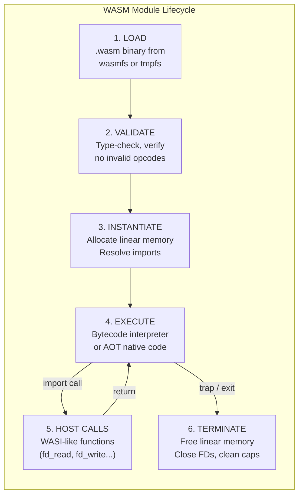
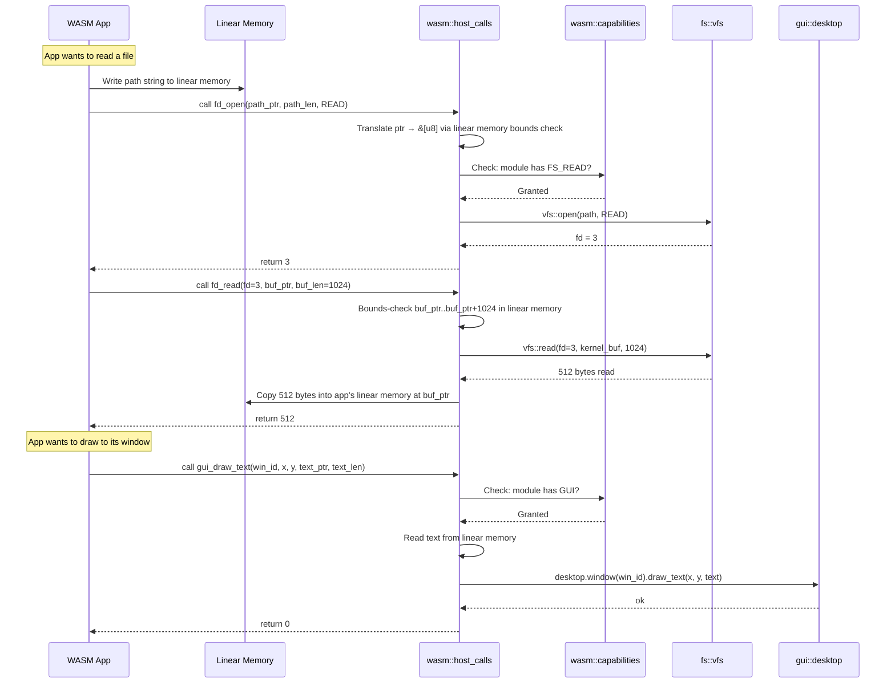
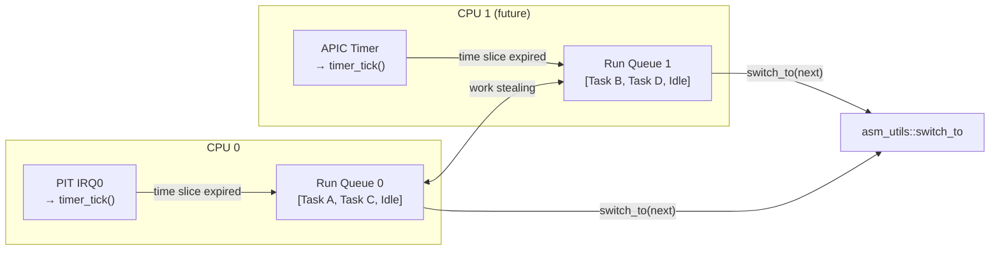
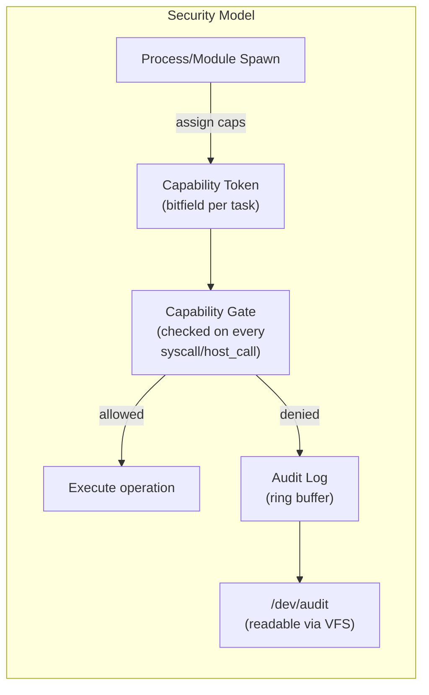

<p align="center"><strong>Florynx-OS System Architecture</strong></p>
<p align="center"><em>v0.3 'Sentinel' — Double-Buffered Compositor + Security Foundation</em></p>

---

# 1. Architecture Overview

Florynx-OS is a 64-bit x86_64 operating system written in Rust (`#![no_std]`).
This document defines the **complete system architecture** including:

- All currently working subsystems (preserved as-is)
- **WebAssembly (WASM) runtime** as a first-class application execution model
- Scalable kernel services (preemptive scheduler, IPC, VFS, security)
- Clear Ring 0 / Ring 3 isolation with capability-based security

**Design philosophy**: Extend, never rewrite. Every new subsystem is additive.

---

# 2. High-Level System Diagram

```mermaid
graph TB
    subgraph USER["USER SPACE (Ring 3)"]
        direction TB

        subgraph WASM_APPS["WASM Applications"]
            WA1["File Manager\n(.wasm)"]
            WA2["Terminal\n(.wasm)"]
            WA3["Settings\n(.wasm)"]
            WA4["Text Editor\n(.wasm)"]
            WA5["3rd-Party App\n(.wasm)"]
        end

        subgraph NATIVE_APPS["Native Applications"]
            NA1["System Monitor\n(ELF)"]
            NA2["Shell\n(ELF)"]
        end

        subgraph USER_LIBS["Userspace Libraries"]
            LIBFX["libflorynx\n(Rust syscall API)"]
            LIBWASI["libflorynx-wasi\n(WASI host impl)"]
        end
    end

    subgraph SYSCALL_GATE["SYSCALL BARRIER (Ring 0 / Ring 3)"]
        direction LR
        SC["syscall::dispatch\nSYSCALL / SYSRET"]
        CAP["security::capability\nCapability gate"]
    end

    subgraph KERNEL["KERNEL SPACE (Ring 0)"]
        direction TB

        subgraph WASM_RT["WASM Runtime Subsystem"]
            direction LR
            WENGINE["wasm::engine\nBytecode interpreter\n+ AOT compiler"]
            WLOADER["wasm::loader\nModule validator\n& instantiator"]
            WSYSCALL["wasm::host_calls\nWASI-like host functions"]
            WLINMEM["wasm::linear_memory\nSandboxed linear memory"]
            WCAP["wasm::capabilities\nPer-module cap tokens"]
        end

        subgraph CORE["Kernel Core"]
            direction LR
            GDT["arch::gdt\nGDT + TSS"]
            IDT["arch::idt\nIDT + handlers"]
            ASM["arch::asm_utils\nswitch_to, I/O\ncli/sti, lgdt"]
            PIC["interrupts::pic\n8259 chained"]
        end

        subgraph SCHED["Scheduler"]
            direction LR
            SCORE["scheduler::core\nPer-CPU run queues"]
            SPREEMPT["scheduler::preempt\nTimer preemption"]
            SBALANCE["scheduler::balance\nWork stealing"]
        end

        subgraph MEM["Memory"]
            direction LR
            PMM["memory::frame_alloc\nO(1) bump alloc"]
            VMM["memory::paging\n4-level PT"]
            HEAP["memory::heap\n16 MiB linked-list"]
            MMAP["memory::mmap\nUser mapping"]
        end

        subgraph IPC_SUB["IPC / Message Bus"]
            direction LR
            CHAN["ipc::channel\nTyped SPSC/MPMC"]
            MSGBUS["ipc::event_bus\nAsync pub/sub"]
            SHMEM["ipc::shared_mem\nZero-copy regions"]
        end

        subgraph FS_SUB["Filesystem"]
            direction LR
            VFS["fs::vfs\nVirtual FS layer"]
            TMPFS["fs::tmpfs\nIn-memory FS"]
            DEVFS["fs::devfs\n/dev nodes"]
            WASMFS["fs::wasmfs\nWASM module store"]
        end

        subgraph DRV["Drivers"]
            direction LR
            DRVMGR["drivers::manager\nRegistry + traits"]
            PS2K["input::keyboard"]
            PS2M["input::mouse"]
            UART["serial::uart"]
            PIT["timer::pit"]
            BGA["display::bga"]
            FBUF["display::framebuffer\nRAM back buffer → VRAM flush"]
        end

        subgraph GUI["GUI Compositor"]
            direction LR
            EVBUS["gui::event_bus\nAsync dispatch"]
            DESKTOP["gui::desktop\nAnimated compositor\ndirty-rect engine (32 rects)"]
            WINMGR["gui::window\nPer-window buffers\ndirty flag"]
            DOCK["gui::dock\nAnimated scale hover"]
            RENDER["gui::renderer\nDraw primitives"]
            ANIM["gui::animation\nLERP engine"]
            WIDGETS["gui::widgets\nButton, Label, Input"]
        end

        subgraph SEC["Security"]
            direction LR
            CAPS["security::capability\nCapability tokens"]
            SANDBOX["security::sandbox\nProcess isolation"]
            AUDIT["security::audit\nEvent log"]
        end
    end

    subgraph HW["HARDWARE"]
        direction LR
        CPU["x86_64 CPU"]
        RAM["RAM"]
        GPU["BGA/VBE"]
        PS2["PS/2"]
        COM["COM1"]
        DISK["Storage"]
    end

    %% === USER → SYSCALL ===
    WA1 & WA2 & WA3 & WA4 & WA5 -->|"host_call"| WSYSCALL
    WSYSCALL -->|"syscall"| SC
    NA1 & NA2 --> LIBFX -->|"syscall"| SC

    %% === SYSCALL → KERNEL ===
    SC -->|"cap check"| CAP
    CAP --> SCHED & FS_SUB & IPC_SUB & MEM

    %% === WASM RUNTIME ===
    WLOADER -->|"validate"| WENGINE
    WENGINE -->|"execute"| WLINMEM
    WSYSCALL -->|"check caps"| WCAP
    WCAP -->|"enforce"| CAPS
    WLINMEM -->|"allocate"| PMM

    %% === SCHEDULER ===
    SCORE -->|"switch_to()"| ASM
    SPREEMPT -->|"IRQ0"| PIT

    %% === MEMORY ===
    VMM --> PMM
    HEAP --> PMM
    MMAP --> VMM

    %% === IPC ===
    MSGBUS --> CHAN
    CHAN --> SHMEM

    %% === FS ===
    VFS --> TMPFS & DEVFS & WASMFS

    %% === GUI ===
    PS2K & PS2M -->|"IRQ"| EVBUS
    EVBUS --> DESKTOP
    DESKTOP --> WINMGR & DOCK
    WINMGR & DOCK --> RENDER --> FBUF --> GPU

    %% === DRIVERS → HW ===
    PIC --> PS2K & PS2M & PIT & UART
    PMM --> RAM
    UART --> COM

    %% === Styles ===
    classDef working fill:#0d4429,stroke:#29D3D0,color:#F3F7FA,stroke-width:2px
    classDef wasm fill:#1a1a40,stroke:#7B61FF,color:#E0D4FF,stroke-width:2px
    classDef planned fill:#1B2330,stroke:#6EF0A2,color:#A8B6C6,stroke-width:1px,stroke-dasharray:5 5
    classDef barrier fill:#2B1A1A,stroke:#F26D6D,color:#F3F7FA,stroke-width:2px
    classDef hw fill:#0D1117,stroke:#555,color:#888

    class GDT,IDT,ASM,PIC,PMM,VMM,HEAP,PS2K,PS2M,UART,PIT,BGA,FBUF,RENDER,DESKTOP,WINMGR,DOCK,CAPS,AUDIT,DEVFS,VFS,TMPFS,SC,CAP,ANIM working
    class WENGINE,WLOADER,WSYSCALL,WLINMEM,WCAP,WASMFS,LIBWASI,WA1,WA2,WA3,WA4,WA5 wasm
    class SCORE,SPREEMPT,SBALANCE,MMAP,CHAN,MSGBUS,SHMEM,DRVMGR,EVBUS,WIDGETS,SANDBOX,LIBFX,NA1,NA2 planned
    class CPU,RAM,GPU,PS2,COM,DISK hw
```



### Legend

| Border | Meaning |
|--------|---------|
| **Solid green** | Currently working in v0.3 |
| **Solid purple** | New WASM subsystem (v0.3 target) |
| **Dashed green** | Planned / stub exists |
| **Red** | Security barrier |
| **Gray** | Hardware |

---

# 3. Layered Architecture View

```
+=========================================================================+
|                       USER SPACE (Ring 3)                               |
|                                                                         |
|  +------------------+  +------------------+  +------------------+       |
|  | WASM App (.wasm) |  | WASM App (.wasm) |  | Native App (ELF) |      |
|  |  [sandboxed]     |  |  [sandboxed]     |  |  [capability]    |      |
|  +--------+---------+  +--------+---------+  +--------+---------+      |
|           |                      |                     |                |
|  +--------v----------------------v---------------------v---------+      |
|  |              libflorynx / libflorynx-wasi                     |      |
|  |           (safe Rust API, WASI host call shim)                |      |
|  +-------------------------------+-------------------------------+      |
+==================================|======================================+
                     SYSCALL (Ring 0 <-> Ring 3)
+==================================|======================================+
|  +-------------------------------v-------------------------------+      |
|  |                   Capability Gate                             |      |
|  |           (every call checked against cap tokens)             |      |
|  +-------------------------------+-------------------------------+      |
|                                  |                                      |
|  +===============================|===============================+      |
|  |                    KERNEL SERVICES                            |      |
|  |                                                               |      |
|  |  +-----------+ +-----------+ +-----------+ +-----------+     |      |
|  |  | Scheduler | |    IPC    | |    VFS    | | Security  |     |      |
|  |  | preempt   | | channels  | | tmpfs     | | caps      |     |      |
|  |  | per-CPU   | | event bus | | devfs     | | sandbox   |     |      |
|  |  | balance   | | shmem     | | wasmfs    | | audit     |     |      |
|  |  +-----------+ +-----------+ +-----------+ +-----------+     |      |
|  +===============================================================+      |
|                                                                         |
|  +===================================================================+  |
|  |                    WASM RUNTIME ENGINE                            |  |
|  |                                                                   |  |
|  |  +------------+ +------------+ +-------------+ +-------------+   |  |
|  |  | Loader     | | Bytecode   | | Linear Mem  | | Host Calls  |   |  |
|  |  | validate   | | interpreter| | sandboxed   | | WASI-like   |   |  |
|  |  | parse      | | + AOT JIT  | | bounds-chk  | | fs,net,gui  |   |  |
|  |  +------------+ +------------+ +-------------+ +-------------+   |  |
|  +===================================================================+  |
|                                                                         |
|  +===================================================================+  |
|  |                    KERNEL CORE (unchanged)                        |  |
|  |                                                                   |  |
|  |  +------+ +------+ +----------+ +---------+ +--------+          |  |
|  |  | GDT  | | IDT  | | asm_utils| | PIC     | | Timer  |          |  |
|  |  +------+ +------+ +----------+ +---------+ +--------+          |  |
|  +===================================================================+  |
|                                                                         |
|  +===================================================================+  |
|  |                    MEMORY SUBSYSTEM (unchanged)                   |  |
|  |  Frame Alloc (O(1)) | Paging (4-level) | Heap (16 MiB)          |  |
|  +===================================================================+  |
|                                                                         |
|  +===================================================================+  |
|  |                    DRIVERS (unchanged + extensible)               |  |
|  |  PS/2 Keyboard | PS/2 Mouse | BGA Display | UART | PIT          |  |
|  +===================================================================+  |
|                                                                         |
|  +===================================================================+  |
|  |                    GUI COMPOSITOR (animated + dirty-rect)         |  |
|  |  Desktop | Windows (per-buf) | Dock (scale) | Animation | Render |  |
|  +===================================================================+  |
+==========================================================================+
|                                                                          |
|  +=======================================================================+
|  |                    USERLAND (florynx-userland/)                       |
|  |  KDE Plasma-Style Shell:                                              |
|  |    Panel [App Menu | Taskbar | Systray+Clock]                         |
|  |    Kickoff Launcher | Notifications | Session Manager                 |
|  |  Apps: Files | Terminal | Settings | Monitor | Editor                  |
|  |  Theme: Breeze Bioluminescent | Wallpaper Manager (3 defaults)        |
|  +=======================================================================+
|                                                                          |
|  +=======================================================================+
|  |                    SHARED (shared/)                                    |
|  |  syscall_abi.rs: SYS_* numbers + GUI/IPC extensions                   |
|  |  types.rs: Rect, Color, GuiEvent, WindowParams, WinFlags              |
|  +=======================================================================+
|                                                                          |
+==========================================================================+
|                         HARDWARE                                         |
|  x86_64 CPU | RAM | BGA/VBE | PS/2 | COM1 | [Storage] | [NIC]          |
+==========================================================================+
```

---

# 4. WASM Integration — Detailed Design

## 4.1 Why WASM for Florynx-OS

| Advantage | Detail |
|-----------|--------|
| **Memory safety** | WASM linear memory is bounds-checked — a buggy app cannot corrupt the kernel or other apps |
| **Portable** | Apps compiled to `.wasm` run on any Florynx-OS build without recompilation |
| **Sandboxed by default** | No raw syscalls — all host interaction goes through declared imports that the kernel can audit and restrict |
| **Lightweight** | No per-process page table needed for WASM apps — they share the kernel address space but are confined to their linear memory |
| **Incremental** | Can run alongside native ELF processes — not a replacement, an additional execution model |
| **Language-agnostic** | Apps can be written in Rust, C, C++, AssemblyScript, Zig — anything that targets WASM |

## 4.2 WASM Runtime Architecture



### Module: `wasm::loader`
- Parse WASM binary format (magic bytes `\0asm`, version 1)
- Validate type section, function section, memory section, import/export section
- Reject modules with invalid opcodes, type mismatches, or unbounded memory requests
- Output: validated `WasmModule` struct ready for instantiation

### Module: `wasm::engine`
- **Phase 1 (interpreter)**: Stack-based bytecode interpreter executing WASM opcodes directly. Simple, correct, auditable. ~2000 lines of Rust.
- **Phase 2 (AOT)**: Ahead-of-time compilation to x86_64 native code at load time. Uses `asm_utils` primitives for code emission. ~10x faster than interpreter.
- Handles: i32/i64/f32/f64 arithmetic, control flow (block/loop/if/br), memory load/store, function calls, table indirect calls.

### Module: `wasm::linear_memory`
- Each WASM module gets a contiguous `Vec<u8>` (or mapped pages) as its linear memory
- All load/store operations are bounds-checked against the declared memory limits
- Memory can grow via `memory.grow` but is capped by the capability token
- **Isolation**: A WASM module can only access its own linear memory — never kernel memory, never another module's memory.

### Module: `wasm::host_calls`
WASI-like host functions that WASM modules can import:

```rust
// Host function table for WASM modules (WASI-like interface)
pub enum HostCall {
    // === Filesystem ===
    FdRead   { fd: u32, buf_ptr: u32, buf_len: u32 } -> i32,
    FdWrite  { fd: u32, buf_ptr: u32, buf_len: u32 } -> i32,
    FdOpen   { path_ptr: u32, path_len: u32, flags: u32 } -> i32,
    FdClose  { fd: u32 } -> i32,

    // === Process ===
    ProcExit { code: u32 } -> !,
    ArgsGet  { argv_ptr: u32, argv_buf_ptr: u32 } -> i32,

    // === GUI (Florynx extension) ===
    GuiCreateWindow  { x: u32, y: u32, w: u32, h: u32, title_ptr: u32 } -> i32,
    GuiDrawRect      { win_id: u32, x: u32, y: u32, w: u32, h: u32, color: u32 } -> i32,
    GuiDrawText      { win_id: u32, x: u32, y: u32, text_ptr: u32, text_len: u32 } -> i32,
    GuiPollEvent     { event_buf_ptr: u32 } -> i32,

    // === Clock ===
    ClockTimeGet     { clock_id: u32 } -> u64,

    // === IPC ===
    ChannelSend      { chan_id: u32, buf_ptr: u32, buf_len: u32 } -> i32,
    ChannelRecv      { chan_id: u32, buf_ptr: u32, buf_len: u32 } -> i32,
}
```

### Module: `wasm::capabilities`
Each WASM module has a capability token that determines which host calls it may invoke:

```rust
bitflags! {
    pub struct WasmCaps: u32 {
        const FS_READ     = 1 << 0;   // fd_read, fd_open(READ)
        const FS_WRITE    = 1 << 1;   // fd_write, fd_open(WRITE)
        const GUI         = 1 << 2;   // GuiCreateWindow, GuiDraw*
        const NET         = 1 << 3;   // future: socket ops
        const IPC         = 1 << 4;   // ChannelSend, ChannelRecv
        const CLOCK       = 1 << 5;   // ClockTimeGet
        const PROC_SPAWN  = 1 << 6;   // spawn child WASM modules
    }
}
```

Every host call checks: `if !module.caps.contains(required_cap) { return EPERM; }`

## 4.3 WASM vs Native Process Comparison

```
+-------------------+---------------------+---------------------+
|                   | WASM Module         | Native ELF Process  |
+-------------------+---------------------+---------------------+
| Isolation         | Linear memory       | Page table          |
|                   | bounds-checking     | (Ring 3 / Ring 0)   |
+-------------------+---------------------+---------------------+
| Memory overhead   | ~64 KiB linear mem  | Full page table     |
|                   | (no PT needed)      | + 4-8 KiB stack     |
+-------------------+---------------------+---------------------+
| Startup time      | ~1 ms (interpret)   | ~5 ms (ELF load +   |
|                   | ~10 ms (AOT)        | page table setup)   |
+-------------------+---------------------+---------------------+
| Syscall path      | host_call → kernel  | SYSCALL → kernel    |
|                   | (function call)     | (CPU mode switch)   |
+-------------------+---------------------+---------------------+
| Performance       | ~5-20x slower       | Native speed        |
|                   | (interpreter)       |                     |
|                   | ~1.5-3x (AOT)       |                     |
+-------------------+---------------------+---------------------+
| Security model    | Capability tokens   | Capability tokens   |
|                   | + import whitelist  | + page isolation    |
+-------------------+---------------------+---------------------+
| Use case          | GUI apps, plugins,  | System services,    |
|                   | 3rd-party untrusted | performance-critical|
+-------------------+---------------------+---------------------+
```

## 4.4 WASM ↔ Kernel Data Flow



---

# 5. Kernel Scalability Enhancements

## 5.1 Multi-Core Preemptive Scheduler

**Current**: Cooperative round-robin, single queue, mono-core.
**Target**: Timer-driven preemptive, per-CPU run queues, work stealing.



**Key changes** (none break existing code):
1. Add `sp: u64` and `kernel_stack: [u8; 8192]` to `Task` struct
2. In PIT IRQ handler: if `time_slice_remaining == 0`, call `switch_to()`
3. New tasks initialized with `asm_utils::init_task_stack()`
4. Future: per-CPU queues when APIC/SMP is added

## 5.2 IPC / Message Bus

**Current**: Stub (empty channel/message modules).
**Target**: Typed channels + async event bus + shared memory.

```rust
// Core channel primitive
pub struct Channel<T: Copy + Send> {
    ring: RingBuffer<T, 256>,      // fixed-size lock-free ring
    sender_cap: Capability,
    receiver_cap: Capability,
    sender_blocked: Option<TaskId>,
    receiver_blocked: Option<TaskId>,
}

// System event bus (pub/sub)
pub struct EventBus {
    subscribers: BTreeMap<EventType, Vec<ChannelId>>,
}

pub enum SystemEvent {
    ProcessSpawned(TaskId),
    ProcessExited(TaskId, i32),
    DeviceAttached(DeviceId),
    WindowFocused(WindowId),
    WasmModuleLoaded(ModuleId),
}
```

## 5.3 VFS with Pluggable Backends

**Current**: Stub (vfs/inode/mount modules, no implementation).
**Target**: Trait-based VFS with tmpfs, devfs, and wasmfs backends.

```rust
pub trait Filesystem: Send + Sync {
    fn name(&self) -> &str;
    fn open(&self, path: &str, flags: OpenFlags) -> Result<Fd, FsError>;
    fn read(&self, fd: Fd, buf: &mut [u8]) -> Result<usize, FsError>;
    fn write(&self, fd: Fd, buf: &[u8]) -> Result<usize, FsError>;
    fn close(&self, fd: Fd) -> Result<(), FsError>;
    fn stat(&self, path: &str) -> Result<FileStat, FsError>;
    fn readdir(&self, path: &str) -> Result<Vec<DirEntry>, FsError>;
}

// Mount table
//   /          → tmpfs (root)
//   /dev       → devfs (device nodes)
//   /app       → wasmfs (WASM module store)
//   /dev/fb0   → framebuffer device
//   /dev/tty0  → serial console
//   /dev/null  → null sink
```

**wasmfs**: Special filesystem that stores `.wasm` binaries. When a WASM app calls `fd_open("/app/terminal.wasm")`, the VFS routes to wasmfs which returns the bytecode for loading into the WASM engine.

## 5.4 Security — Sandbox + Capabilities + Audit



**Three layers of defense**:

1. **Capability tokens** — Each task/module has a bitfield of allowed operations. Assigned at spawn time, immutable after. Principle of least privilege.
2. **Sandbox** — WASM modules are sandboxed by linear memory bounds. Native processes are sandboxed by page table isolation. Syscall filter can restrict which syscalls a process may invoke.
3. **Audit log** — Every denied capability check is logged to a ring buffer. Readable via `/dev/audit`. Enables security monitoring and debugging.

---

# 6. Boot Sequence (v0.2 — Unchanged)

All phases remain exactly as they are. WASM runtime initializes in a new Phase 5b.

```
Phase 1: GDT → IDT → PIC + PIT                    [arch, interrupts]
Phase 2: Paging → Frame Alloc → Heap (16 MiB)      [memory]
Phase 3: BGA Framebuffer → Console → Mouse          [drivers, gui]
Phase 4: Enable Interrupts                           [arch]
Phase 5a: post_init() → launch_desktop()             [gui]
Phase 5b: wasm::engine::init() (NEW — loads runtime) [wasm]
Phase 6: hlt_loop with redraw_if_needed()            [main]
```

---

# 7. Memory Map (Updated)

| Region | Address | Size | Status |
|--------|---------|------|--------|
| Kernel Code | Bootloader-defined | ~256 KiB | Working |
| Kernel Heap | `0x4444_4444_0000` | 16 MiB | Working |
| BGA Framebuffer | `0xFD000000` (phys) | 3 MiB | Working |
| WASM Linear Memory Pool | `0x5555_0000_0000` | 64 MiB (configurable) | Planned |
| User Process Space | `0x0000_4000_0000` | 2 GiB | Planned |
| Kernel Stack (per-task) | Heap-allocated | 8 KiB each | Planned |

---

# 8. Current Working Modules (Preserved As-Is)

| Module | Path | Description |
|--------|------|-------------|
| `arch::gdt` | `src/arch/x86_64/gdt.rs` | GDT + TSS, kernel/user segments |
| `arch::idt` | `src/arch/x86_64/idt.rs` | IDT, exception + IRQ handlers |
| `arch::asm_utils` | `src/arch/x86_64/asm_utils.rs` | switch_to, I/O ports, cli/sti, lgdt/lidt |
| `arch::cpu` | `src/arch/x86_64/cpu.rs` | CPUID, vendor string, halt |
| `interrupts::pic` | `src/interrupts/pic.rs` | 8259 chained PIC |
| `timer::pit` | `src/drivers/timer/pit.rs` | 8254 PIT at 200 Hz |
| `input::keyboard` | `src/drivers/input/keyboard.rs` | PS/2 scancode → ASCII |
| `input::mouse` | `src/drivers/input/mouse.rs` | PS/2 3-byte, timeout-safe |
| `serial::uart` | `src/drivers/serial/uart.rs` | UART 16550, COM1 |
| `display::bga` | `src/drivers/display/bga.rs` | Bochs VBE 1024x768 |
| `display::framebuffer` | `src/drivers/display/framebuffer.rs` | Double-buffered: RAM back buffer → VRAM flush_rect/flush_full |
| `memory::paging` | `src/memory/paging.rs` | 4-level page table |
| `memory::frame_allocator` | `src/memory/frame_allocator.rs` | O(1) bump allocator |
| `memory::heap` | `src/memory/heap.rs` | 16 MiB linked-list |
| `process::scheduler` | `src/process/scheduler.rs` | Round-robin, timer-based, task exit() |
| `process::task` | `src/process/task.rs` | Task struct, user-mode jump |
| `process::context` | `src/process/context.rs` | CpuContext (all GPRs) |
| `gui::animation` | `src/gui/animation.rs` | LERP engine, AnimatedPos/Opacity/Scale |
| `gui::renderer` | `src/gui/renderer.rs` | Primitives, font, cursor |
| `gui::theme` | `src/gui/theme.rs` | Bioluminescent palette |
| `gui::desktop` | `src/gui/desktop.rs` | Animated compositor, 32-rect dirty engine, per-frame tick |
| `gui::window` | `src/gui/window.rs` | Per-window buffer, dirty flag, animated pos/opacity |
| `gui::dock` | `src/gui/dock.rs` | Floating dock, animated hover scale (1.25×) |
| `gui::console` | `src/gui/console.rs` | Early-boot framebuffer text |
| `gui::event` | `src/gui/event.rs` | Rect, mouse events |
| `gui::icons` | `src/gui/icons.rs` | 16x16 + 8x8 bitmaps |
| `core::kernel` | `src/core/kernel.rs` | post_init, CPU info |
| `core::logging` | `src/core/logging.rs` | serial_print! macros |
| `core::panic` | `src/core/panic.rs` | Panic handler |
| `time::clock` | `src/time/clock.rs` | System clock |

**These modules will NOT be modified.** New functionality is added in new files/modules only.

---

# 9. Target File Structure (v0.3+)

```
florynx-kernel/src/
├── arch/x86_64/
│   ├── gdt.rs                  ✅ unchanged
│   ├── idt.rs                  ✅ unchanged
│   ├── asm_utils.rs            ✅ unchanged
│   ├── cpu.rs                  ✅ unchanged
│   ├── interrupts.rs           ✅ unchanged
│   ├── apic.rs                 🔲 APIC/IOAPIC for SMP
│   └── syscall_entry.rs        🔲 SYSCALL/SYSRET MSR setup
│
├── memory/
│   ├── paging.rs               ✅ unchanged
│   ├── frame_allocator.rs      ✅ unchanged
│   ├── heap.rs                 ✅ unchanged
│   ├── mapper.rs               ✅ unchanged
│   └── user_space.rs           🔲 per-process address spaces
│
├── process/
│   ├── task.rs                 ✅ (extend: add sp + kernel_stack)
│   ├── scheduler.rs            ✅ (extend: add preemption hook)
│   ├── context.rs              ✅ unchanged
│   └── process.rs              ✅ unchanged
│
├── wasm/                        🆕 NEW SUBSYSTEM
│   ├── mod.rs                  🔲 module root
│   ├── engine.rs               🔲 bytecode interpreter
│   ├── loader.rs               🔲 .wasm parser + validator
│   ├── linear_memory.rs        🔲 sandboxed memory regions
│   ├── host_calls.rs           🔲 WASI-like host functions
│   ├── capabilities.rs         🔲 per-module cap tokens
│   └── aot.rs                  🔲 AOT compiler (phase 2)
│
├── ipc/
│   ├── channel.rs              🟡 → implement typed channels
│   ├── message.rs              🟡 → implement message format
│   ├── event_bus.rs            🔲 async pub/sub
│   └── shared_mem.rs           🔲 zero-copy IPC
│
├── fs/
│   ├── vfs.rs                  🟡 → implement VFS trait
│   ├── inode.rs                🟡 → implement inodes
│   ├── mount.rs                🟡 → implement mount table
│   ├── tmpfs.rs                🔲 in-memory FS
│   ├── devfs.rs                ✅ /dev/null, /dev/zero, /dev/serial0
│   └── wasmfs.rs               🔲 WASM module store
│
├── syscall/
│   ├── table.rs                🟡 → implement dispatch table
│   ├── handlers.rs             🟡 → implement syscall handlers
│   └── abi.rs                  🔲 ABI constants
│
├── drivers/
│   ├── display/                ✅ double-buffered framebuffer
│   ├── input/                  ✅ unchanged
│   ├── serial/                 ✅ unchanged
│   ├── timer/                  ✅ unchanged
│   ├── manager.rs              🔲 driver registry
│   └── pci/                    🔲 PCI enumeration
│
├── gui/
│   ├── animation.rs            ✅ LERP engine, AnimatedPos/Opacity/Scale
│   ├── renderer.rs             ✅ draw primitives + cursor (double-buffered)
│   ├── theme.rs                ✅ bioluminescent palette
│   ├── desktop.rs              ✅ animated compositor + 32-rect dirty + merge
│   ├── window.rs               ✅ per-window buffer, dirty flag, animated pos
│   ├── dock.rs                 ✅ floating dock, animated hover scale (1.25×)
│   ├── console.rs              ✅ early-boot framebuffer text
│   ├── event.rs                ✅ Rect (intersects/union/clamp), events
│   ├── icons.rs                ✅ 16x16 + 8x8 bitmaps
│   ├── event_bus.rs            🔲 async event dispatch
│   └── widgets/                🔲 Button, Label, TextInput
│
├── security/
│   ├── mod.rs                  ✅ module root
│   ├── capability.rs           ✅ 18 bitflag caps, CapabilitySet, presets
│   ├── isolation.rs            🟡 → implement sandboxing
│   └── audit.rs                ✅ 256-entry ring buffer audit log
│
├── runtime/
│   ├── elf_loader.rs           🟡 → implement ELF64 parser
│   └── process_spawn.rs        🟡 → implement spawning
│
├── lib.rs                      ✅ (extend: add wasm module)
└── main.rs                     ✅ (extend: add Phase 5b)
```

### Userland (florynx-userland/)
```
florynx-userland/
├── src/
│   ├── gui/
│   │   ├── shell.rs            ✅ KDE Plasma-style desktop compositor
│   │   ├── panel.rs            ✅ Bottom panel (menu + taskbar + systray)
│   │   ├── app_menu.rs         ✅ Kickoff-style launcher with categories
│   │   ├── taskbar.rs          ✅ Window task list with active highlight
│   │   ├── systray.rs          ✅ System tray with clock
│   │   ├── wallpaper.rs        ✅ Wallpaper manager (3 defaults)
│   │   └── theme.rs            ✅ Breeze Bioluminescent palette
│   ├── apps/
│   │   ├── files.rs            🟡 Dolphin-style file manager
│   │   ├── terminal.rs         🟡 Konsole-style terminal
│   │   ├── settings.rs         🟡 System settings
│   │   ├── monitor.rs          🟡 System monitor
│   │   └── editor.rs           🟡 Kate-style text editor
│   └── system/
│       ├── session.rs          ✅ Session manager
│       └── notif.rs            ✅ Notification daemon
└── assets/
    └── wallpapers/             ✅ 3 bioluminescent wallpapers
```

### Shared Types (shared/)
```
shared/
└── src/
    ├── lib.rs                  ✅ no_std shared crate root
    ├── syscall_abi.rs          ✅ SYS_* numbers + GUI/IPC extensions
    └── types.rs                ✅ Rect, Color, GuiEvent, WindowParams
```

Legend: ✅ = Working | 🟡 = Stub → implement | 🔲 = New file | 🆕 = New subsystem

---

*Florynx-OS v0.3.0 'Sentinel' Architecture — April 2026*
*Kernel/Userland split • KDE Plasma-style shell • Animation engine • 108 features.*
*WASM integration inspired by Wasmtime, Redox OS, and Fuchsia Zircon.*
