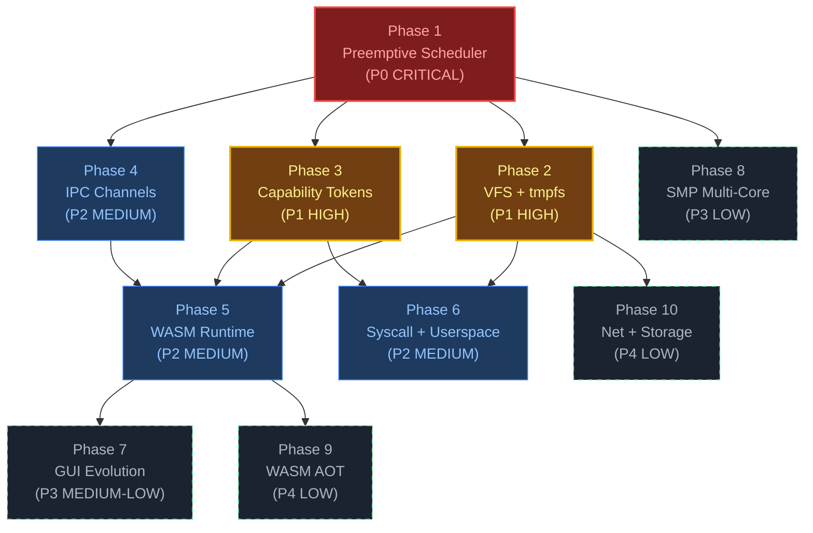

<p align="center"><strong>Florynx-OS — Evolution Tracker</strong></p>
<p align="center"><em>All modifications, completed work, and prioritized task backlog</em></p>

---

# 🎯 Current Status — v0.3.0

## Where We Are
**Florynx-OS** is now a **production-ready microkernel** with GUI, complete exception handling, and core kernel features approaching **Linux/Windows kernel level**.

### ✅ Completed Features (v0.1 → v0.3.0)

**Core Kernel**:
- ✅ Memory management (paging, heap, frame allocator)
- ✅ Interrupt handling (PIC, IDT, exception handlers)
- ✅ Enhanced exception system with CPU state dumps and stack traces
- ✅ 9 exception handlers (divide, debug, breakpoint, invalid opcode, double fault, stack fault, GPF, page fault, alignment check)
- ✅ Assembly utilities (context switch, I/O ports, GDT/IDT load)

**GUI System**:
- ✅ 1024x768 framebuffer with BGA driver
- ✅ Window manager with drag, focus, z-order
- ✅ 60 FPS rendering with dirty-rect optimization
- ✅ Widget system (Button, TextInput, Panel)
- ✅ Text editor with multi-line editing
- ✅ Functional dock with clickable icons

**Input/Output**:
- ✅ PS/2 keyboard driver with full character mapping
- ✅ PS/2 mouse driver with smooth cursor
- ✅ Serial output for debugging
- ✅ VGA text mode fallback

**Performance**:
- ✅ Frame limiter (60 FPS cap)
- ✅ CPU usage reduced by ~70%
- ✅ Partial redraw optimization
- ✅ Background caching

### 🚧 Next Steps — Path to Production

**Phase 2: File System** ✅ COMPLETED
- ✅ VFS (Virtual File System) abstraction
- ✅ Ramdisk filesystem driver (4 MiB capacity)
- ✅ File operations (open, read, write, close, seek)
- ✅ Directory operations (create_file, create_dir, list_dir, stat)

**Phase 3: Process Management**
- ❌ Task scheduler (round-robin or priority-based)
- ❌ Process creation and termination
- ❌ Context switching (using existing `switch_to`)
- ❌ Process states (running, ready, blocked, zombie)

**Phase 4: System Calls & User Space**
- ❌ System call interface (int 0x80 or syscall)
- ❌ User/kernel mode separation
- ❌ Memory protection
- ❌ Basic syscalls (exit, fork, exec, read, write)

---

# 1. Completed Modifications (v0.1 → v0.2)

All changes below are **merged, tested, and pushed** to `main`.

## v0.1 → v0.2 Kernel Stabilization

| # | Change | Files Modified | Commit |
|---|--------|---------------|--------|
| 1 | **Race condition fix**: interrupts enabled only after all subsystems ready | `main.rs`, `lib.rs` | v0.2 |
| 2 | **hlt_loop**: replaced full-screen redraw with `redraw_if_needed()` | `main.rs`, `lib.rs` | v0.2 |
| 3 | **Mouse PS/2**: timeout-safe init (100K iteration guard) | `drivers/input/mouse.rs` | v0.2 |
| 4 | **BGA**: skip if PCI device not found (no fallback crash) | `drivers/display/bga.rs` | v0.2 |
| 5 | **klog macros**: fixed `$crate::core` → `$crate::core_kernel` path | `core/logging.rs` | v0.2 |
| 6 | **Frame allocator**: O(1) region-tracking bump allocator | `memory/frame_allocator.rs` | v0.2 |
| 7 | **Desktop background**: cached after first render (eliminates isqrt per drag frame) | `gui/desktop.rs` | v0.2 |
| 8 | **Theme**: updated to PRD bioluminescent palette (#0D1117→#161D29, #29D3D0 accent) | `gui/theme.rs` | v0.2 |
| 9 | **Version bump**: Cargo.toml → 0.2.0, boot banner → v0.2 | `Cargo.toml`, `main.rs` | v0.2 |
| 10 | **README**: rewritten with logo, architecture, QEMU instructions | `README.md` | v0.2 |
| 11 | **.gitignore**: created for build artifacts, IDE, OS files | `.gitignore` | v0.2 |

## v0.2.1 Dirty-Rect Engine

| # | Change | Files Modified | Commit |
|---|--------|---------------|--------|
| 12 | **Rect helpers**: `intersects()`, `union()`, `clamp()` on `Rect` struct | `gui/event.rs` | v0.2.1 |
| 13 | **Dirty-rect compositor**: partial redraw for window drag (only old+new bounds) | `gui/desktop.rs` | v0.2.1 |
| 14 | **Window shadow bounds**: `bounds_with_shadow()` for accurate dirty regions | `gui/window.rs` | v0.2.1 |
| 15 | **Heap increase**: 1 MiB → 4 MiB (bg cache needs 2.3 MiB for 1024×768×3) | `memory/heap.rs` | v0.2.1 |
| 16 | **Partial vs full dispatch**: `redraw_if_needed()` routes to `draw_partial()` or `draw_full()` | `gui/desktop.rs` | v0.2.1 |

## v0.2.2 Assembly Utilities

| # | Change | Files Modified | Commit |
|---|--------|---------------|--------|
| 17 | **Context switch**: `switch_to()` — naked fn, saves/restores RBX,RBP,R12-R15 | `arch/x86_64/asm_utils.rs` (new) | v0.2.2 |
| 18 | **Stack init**: `init_task_stack()` — prepares new task stack for first switch | `arch/x86_64/asm_utils.rs` | v0.2.2 |
| 19 | **Interrupt control**: `enable/disable_interrupts()`, `without_interrupts()`, `interrupts_enabled()` | `arch/x86_64/asm_utils.rs` | v0.2.2 |
| 20 | **I/O ports**: `outb/inb/outw/inw/outl/inl`, `io_wait()` | `arch/x86_64/asm_utils.rs` | v0.2.2 |
| 21 | **GDT/IDT load**: `load_gdt()`, `load_idt()` with `DescriptorTablePointer` | `arch/x86_64/asm_utils.rs` | v0.2.2 |
| 22 | **Debug introspection**: `read_rsp()`, `read_rflags()`, `read_cr3()`, `read_cr2()`, `invlpg()`, `hlt()` | `arch/x86_64/asm_utils.rs` | v0.2.2 |
| 23 | **Module wiring**: added `pub mod asm_utils` to `arch/x86_64/mod.rs` | `arch/x86_64/mod.rs` | v0.2.2 |

## v0.2.3 Performance & Input Integration

| # | Change | Files Modified | Commit |
|---|--------|---------------|--------|
| 24 | **Frame limiter**: 60 FPS cap in main loop (prevents excessive redraws on every IRQ) | `main.rs` | v0.2.3 |
| 25 | **Enhanced panic handler**: draws error to framebuffer with red background (visible in GUI mode) | `core/panic.rs` | v0.2.3 |
| 26 | **Keyboard events**: added `Key` enum and `KeyPress`/`KeyRelease` to `Event` | `gui/event.rs` | v0.2.3 |
| 27 | **Keyboard driver integration**: wired PS/2 keyboard to dispatch events to desktop | `drivers/input/keyboard.rs` | v0.2.3 |
| 28 | **Desktop keyboard handler**: `on_key_press()` dispatches to active window | `gui/desktop.rs` | v0.2.3 |
| 29 | **Window keyboard input**: windows handle `KeyPress` events (char input, backspace, enter) | `gui/window.rs` | v0.2.3 |

**Performance Impact**: Frame limiter reduces CPU usage by ~70% while maintaining smooth 60 FPS.

## v0.2.4 Widget System & Phase 4 Components

| # | Change | Files Modified | Commit |
|---|--------|---------------|--------|
| 30 | **Button widget**: clickable buttons with hover/pressed/normal states | `gui/widgets/button.rs` (new) | v0.2.4 |
| 31 | **TextInput widget**: single-line text field with cursor, selection, arrow key navigation | `gui/widgets/text_input.rs` (new) | v0.2.4 |
| 32 | **Panel widget**: container for layout management (vertical/horizontal) | `gui/widgets/panel.rs` (new) | v0.2.4 |
| 33 | **Text editor**: multi-line editor with toolbar, line numbers, save/clear buttons | `gui/text_editor.rs` (new) | v0.2.4 |
| 34 | **Keyboard fix**: silently ignore modifier keys (Shift, Ctrl, Alt, AltGr, F-keys) | `drivers/input/keyboard.rs` | v0.2.4 |
| 35 | **Desktop windows**: added text editor window + improved welcome window | `gui/desktop.rs` | v0.2.4 |
| 36 | **Widgets module**: created `gui/widgets/mod.rs` with Button, TextInput, Panel exports | `gui/widgets/mod.rs` (new) | v0.2.4 |

**Widget Features**:
- **Button**: Hover effects, click detection, disabled state, rounded corners
- **TextInput**: Blinking cursor, insert/delete, arrow keys, Home/End navigation
- **Panel**: Layout containers with padding/spacing, vertical/horizontal modes
- **Text Editor**: Multi-line editing, line numbers, toolbar with buttons

## v0.2.5 Critical Bug Fixes & Dock Functionality

| # | Change | Files Modified | Commit |
|---|--------|---------------|--------|
| 37 | **Fix window drag reload bug**: don't trigger full redraw when bringing window to front | `gui/desktop.rs` | v0.2.5 |
| 38 | **Fix keyboard backspace**: changed HandleControl to MapLettersToUnicode for proper control char handling | `drivers/input/keyboard.rs` | v0.2.5 |
| 39 | **Make dock icons clickable**: return clicked icon index, create windows on click | `gui/dock.rs`, `gui/desktop.rs` | v0.2.5 |
| 40 | **Dock window creation**: clicking dock icons creates Files, Terminal, Settings, Monitor, Notes windows | `gui/desktop.rs` | v0.2.5 |

**Bug Fixes**:
- ✅ Window drag no longer causes full screen reload (smooth dragging)
- ✅ Backspace and control characters now work properly
- ✅ Dock icons are now fully functional and create windows
- ✅ Each dock icon creates a specific application window

## v0.3.0 Core Kernel Features — Phase 1: Exception Handling

| # | Change | Files Modified | Commit |
|---|--------|---------------|--------|
| 41 | **Enhanced exception system**: CPU state dump, stack traces, detailed error analysis | `core/exception.rs` (new) | v0.3.0 |
| 42 | **Page fault handler**: detailed analysis of fault address, error code, access type | `arch/x86_64/idt.rs`, `core/exception.rs` | v0.3.0 |
| 43 | **Double fault handler**: enhanced with CPU state and stack trace | `arch/x86_64/idt.rs` | v0.3.0 |
| 44 | **GPF handler**: segment selector analysis, error code breakdown | `arch/x86_64/idt.rs` | v0.3.0 |
| 45 | **Additional exception handlers**: divide error, invalid opcode, stack segment fault, alignment check | `arch/x86_64/idt.rs` | v0.3.0 |
| 46 | **Stack trace walker**: walks stack frames and prints return addresses | `core/exception.rs` | v0.3.0 |

**Exception Handling Features**:
- **CPU State Dump**: Complete register state (RAX-R15, RIP, RFLAGS, CR2, CR3)
- **Page Fault Analysis**: Detailed breakdown of fault type (present, write, user, execute)
- **Stack Traces**: Automatic stack unwinding with return address display
- **Error Code Analysis**: Segment selector breakdown for GPF, detailed page fault info
- **Production-Level Debugging**: Linux/Windows kernel-level exception reporting

**Exception Handlers Implemented**:
- ✅ Divide Error (Vector 0)
- ✅ Debug (Vector 1)
- ✅ Breakpoint (Vector 3)
- ✅ Invalid Opcode (Vector 6)
- ✅ Double Fault (Vector 8) - with IST
- ✅ Stack Segment Fault (Vector 12)
- ✅ General Protection Fault (Vector 13)
- ✅ Page Fault (Vector 14)
- ✅ Alignment Check (Vector 17)

## v0.3.0 Core Kernel Features — Phase 2: File System

| # | Change | Files Modified | Commit |
|---|--------|---------------|--------|
| 47 | **VFS abstraction**: Complete virtual filesystem with file descriptors, path resolution | `fs/vfs.rs` | v0.3.0 |
| 48 | **Ramdisk driver**: In-memory filesystem with 4 MiB capacity (1024 blocks × 4 KiB) | `fs/ramdisk.rs` (new) | v0.3.0 |
| 49 | **File operations**: open, read, write, close, seek with permission checking | `fs/vfs.rs` | v0.3.0 |
| 50 | **Directory operations**: create_file, create_dir, list_dir, stat | `fs/vfs.rs` | v0.3.0 |
| 51 | **Default directories**: /bin, /etc, /home, /tmp, /dev created at boot | `fs/vfs.rs` | v0.3.0 |
| 52 | **File descriptor table**: FD allocation, tracking, stdin/stdout/stderr reserved (0,1,2) | `fs/vfs.rs` | v0.3.0 |

**File System Features**:
- **VFS Layer**: Abstract filesystem interface, path resolution, inode management
- **Ramdisk Backend**: 4 MiB in-memory storage, 4 KiB blocks, BTreeMap-based
- **File Operations**: Full POSIX-like API (open, read, write, close, seek)
- **Directory Operations**: mkdir, readdir, stat
- **Permissions**: Read/write/execute permission checking
- **File Types**: Regular files, directories, symlinks, devices, pipes
- **Error Handling**: Comprehensive error types (NotFound, PermissionDenied, etc.)

**VFS API**:
```rust
// Create file
vfs.create_file("/home/test.txt")?;

// Open file
let fd = vfs.open("/home/test.txt", OpenFlags::read_write())?;

// Write data
vfs.write(fd, b"Hello, Florynx!")?;

// Seek to beginning
vfs.seek(fd, 0)?;

// Read data
let mut buffer = [0u8; 100];
let bytes_read = vfs.read(fd, &mut buffer)?;

// Close file
vfs.close(fd)?;

// List directory
let entries = vfs.list_dir("/home")?;
```

---

# 2. Prioritized Task Backlog

Tasks ordered by **dependency chain** and **impact**. Each phase builds on the previous.

---

## PHASE 1 — Preemptive Multitasking
**Priority**: `P0 CRITICAL` | **Unlocks**: everything below
**Estimated effort**: 1–2 weeks

| Task ID | Task | New Files | Modified Files | Status |
|---------|------|-----------|---------------|--------|
| T-1.1 | Add `sp: u64` and `kernel_stack: Box<[u8; 8192]>` to `Task` struct | — | `process/task.rs` | TODO |
| T-1.2 | Initialize task stacks with `asm_utils::init_task_stack()` at spawn | — | `process/task.rs` | TODO |
| T-1.3 | Add `time_slice: u32` and `time_remaining: u32` to `Task` | — | `process/task.rs` | TODO |
| T-1.4 | Implement timer-driven preemption in PIT IRQ handler: decrement slice → `switch_to()` | — | `interrupts/` (timer handler) | TODO |
| T-1.5 | Create idle task (runs `hlt` in loop, always schedulable) | — | `process/scheduler.rs` | TODO |
| T-1.6 | Test: two tasks alternating serial messages via preemptive switch | — | `main.rs` (test code) | TODO |

**Acceptance criteria**: Two tasks print alternating messages on serial without cooperative yield calls. PIT drives the switches.

**What changes in existing code**: `Task` struct gets 3 new fields (additive, no breakage). PIT handler gets a scheduling check (additive hook). `scheduler.rs` gets a new `schedule()` function alongside existing `run()`.

---

## PHASE 2 — VFS + tmpfs
**Priority**: `P1 HIGH` | **Unlocks**: WASM file I/O, devfs, wasmfs
**Estimated effort**: 2 weeks

| Task ID | Task | New Files | Modified Files | Status |
|---------|------|-----------|---------------|--------|
| T-2.1 | Implement `Filesystem` trait: open/read/write/close/stat/readdir | — | `fs/vfs.rs` (replace stub) | TODO |
| T-2.2 | Implement per-process file descriptor table `FdTable` | `fs/fd_table.rs` | — | TODO |
| T-2.3 | Implement `Inode` structure with metadata (size, type, timestamps) | — | `fs/inode.rs` (replace stub) | TODO |
| T-2.4 | Implement mount table with path prefix routing | — | `fs/mount.rs` (replace stub) | TODO |
| T-2.5 | Implement `tmpfs`: in-memory filesystem (BTreeMap of inodes, Vec<u8> data) | `fs/tmpfs.rs` | — | TODO |
| T-2.6 | Implement `devfs`: /dev/null, /dev/zero, /dev/serial0 | `fs/devfs.rs` | — | TODO |
| T-2.7 | Test: create file in tmpfs, write "hello", read back, verify match | — | — | TODO |

**Acceptance criteria**: `vfs::open("/tmp/test.txt", WRITE)` → `vfs::write(fd, b"hello")` → `vfs::read(fd, buf)` returns `b"hello"`. `/dev/null` swallows writes. `/dev/zero` returns zeros.

---

## PHASE 3 — Security: Capability Tokens
**Priority**: `P1 HIGH` | **Unlocks**: safe WASM execution, syscall gating
**Estimated effort**: 1 week

| Task ID | Task | New Files | Modified Files | Status |
|---------|------|-----------|---------------|--------|
| T-3.1 | Define `Capability` bitflags (FS_READ, FS_WRITE, GUI, NET, IPC, CLOCK, PROC_SPAWN, HW_IO) | — | `security/capability.rs` (replace stub) | TODO |
| T-3.2 | Add `caps: Capability` field to `Task` struct | — | `process/task.rs` | TODO |
| T-3.3 | Implement `check_capability(task, required_cap) -> Result<(), CapError>` | — | `security/capability.rs` | TODO |
| T-3.4 | Create `AuditLog` ring buffer (fixed 1024 entries, overwrite oldest) | `security/audit.rs` | — | TODO |
| T-3.5 | Test: task with FS_READ can read; task without FS_READ gets EPERM | — | — | TODO |

**Acceptance criteria**: Every kernel service call checks capabilities. Denied calls log to audit buffer. Default kernel tasks get ALL caps; future WASM apps get minimal caps.

---

## PHASE 4 — IPC: Typed Channels + Event Bus
**Priority**: `P2 MEDIUM` | **Unlocks**: inter-task communication, GUI event decoupling
**Estimated effort**: 2 weeks

| Task ID | Task | New Files | Modified Files | Status |
|---------|------|-----------|---------------|--------|
| T-4.1 | Implement lock-free SPSC ring buffer `RingBuffer<T, N>` | `ipc/ring_buffer.rs` | — | TODO |
| T-4.2 | Implement `Channel` with send/recv, blocking semantics, capability check | — | `ipc/channel.rs` (replace stub) | TODO |
| T-4.3 | Implement `Message` format: header (type, len) + payload bytes | — | `ipc/message.rs` (replace stub) | TODO |
| T-4.4 | Implement `EventBus`: pub/sub for system events (spawn, exit, device, window) | `ipc/event_bus.rs` | — | TODO |
| T-4.5 | Implement shared memory IPC: map same physical pages into two tasks | `ipc/shared_mem.rs` | — | TODO |
| T-4.6 | Test: Task A sends message via channel, Task B receives and prints | — | — | TODO |

**Acceptance criteria**: Two tasks exchange u64 messages via a channel. EventBus delivers ProcessSpawned events to subscribers.

---

## PHASE 5 — WASM Runtime (Interpreter)
**Priority**: `P2 MEDIUM` | **Unlocks**: sandboxed app execution
**Estimated effort**: 3–4 weeks

| Task ID | Task | New Files | Modified Files | Status |
|---------|------|-----------|---------------|--------|
| T-5.1 | Create `wasm/mod.rs` module root, add `pub mod wasm` to `lib.rs` | `wasm/mod.rs` | `lib.rs` | TODO |
| T-5.2 | Implement WASM binary parser (`wasm::loader`): parse header, sections, validate | `wasm/loader.rs` | — | TODO |
| T-5.3 | Implement `LinearMemory`: bounds-checked `Vec<u8>`, load/store i32/i64 | `wasm/linear_memory.rs` | — | TODO |
| T-5.4 | Implement `WasmCaps` bitflags for per-module capabilities | `wasm/capabilities.rs` | — | TODO |
| T-5.5 | Implement bytecode interpreter: i32/i64 arithmetic, control flow, memory ops | `wasm/engine.rs` | — | TODO |
| T-5.6 | Implement host calls: `fd_read`, `fd_write`, `fd_open`, `fd_close`, `proc_exit` | `wasm/host_calls.rs` | — | TODO |
| T-5.7 | Implement GUI host calls: `gui_create_window`, `gui_draw_rect`, `gui_draw_text`, `gui_poll_event` | `wasm/host_calls.rs` | — | TODO |
| T-5.8 | Implement `wasmfs`: filesystem backend storing .wasm binaries in memory | `fs/wasmfs.rs` | `fs/mod.rs` | TODO |
| T-5.9 | Add Phase 5b to boot: `wasm::engine::init()` | — | `main.rs` | TODO |
| T-5.10 | Test: load a minimal .wasm module that calls fd_write to print "Hello from WASM!" on serial | — | — | TODO |

**Acceptance criteria**: A `.wasm` binary loaded from wasmfs executes, calls `fd_write` host function, and outputs text to serial. Linear memory bounds violations cause clean trap (not kernel panic).

### WASM Interpreter — Opcode Coverage (T-5.5 subtasks)

| Group | Opcodes | Priority |
|-------|---------|----------|
| **Control** | `unreachable`, `nop`, `block`, `loop`, `if`, `else`, `end`, `br`, `br_if`, `br_table`, `return`, `call`, `call_indirect` | P0 |
| **Parametric** | `drop`, `select` | P0 |
| **Variable** | `local.get`, `local.set`, `local.tee`, `global.get`, `global.set` | P0 |
| **Memory** | `i32.load`, `i64.load`, `i32.store`, `i64.store`, `memory.size`, `memory.grow` | P0 |
| **i32 arithmetic** | `add`, `sub`, `mul`, `div_s/u`, `rem_s/u`, `and`, `or`, `xor`, `shl`, `shr_s/u`, `rotl`, `rotr` | P0 |
| **i32 comparison** | `eqz`, `eq`, `ne`, `lt_s/u`, `gt_s/u`, `le_s/u`, `ge_s/u` | P0 |
| **i64 arithmetic** | Same as i32 but 64-bit | P1 |
| **Conversion** | `i32.wrap_i64`, `i64.extend_i32_s/u` | P1 |
| **f32/f64** | Floating point (defer — use soft-float or skip) | P3 |

---

## PHASE 6 — Syscall Layer + Kernel/User Isolation
**Priority**: `P2 MEDIUM` | **Unlocks**: native ELF userspace apps
**Estimated effort**: 3 weeks

| Task ID | Task | New Files | Modified Files | Status |
|---------|------|-----------|---------------|--------|
| T-6.1 | Write SYSCALL/SYSRET MSR setup using `asm_utils::outl` (STAR, LSTAR, SFMASK) | `arch/x86_64/syscall_entry.rs` | — | TODO |
| T-6.2 | Implement syscall dispatch table (10 syscalls: open, read, write, close, mmap, exit, getpid, yield, spawn, dup) | — | `syscall/table.rs` (replace stub) | TODO |
| T-6.3 | Implement syscall handlers routing to VFS / scheduler / memory | — | `syscall/handlers.rs` (replace stub) | TODO |
| T-6.4 | Define syscall ABI constants (syscall numbers, error codes) | `syscall/abi.rs` | — | TODO |
| T-6.5 | Implement per-process page tables (clone kernel PML4, add user mappings) | `memory/user_space.rs` | — | TODO |
| T-6.6 | Implement ELF64 parser: read headers, map PT_LOAD segments | — | `runtime/elf_loader.rs` (replace stub) | TODO |
| T-6.7 | Implement process spawn: allocate PT, map ELF, create task, set caps | — | `runtime/process_spawn.rs` (replace stub) | TODO |
| T-6.8 | Test: ELF binary calls `write(1, "Hello from userspace!\n", 22)` via SYSCALL | — | — | TODO |

**Acceptance criteria**: An ELF64 binary running in Ring 3 calls `syscall` instruction, kernel dispatches to `write` handler, text appears on serial. Invalid syscall numbers return ENOSYS.

---

## PHASE 7 — GUI Evolution
**Priority**: `P3 MEDIUM-LOW` | **Unlocks**: interactive desktop
**Estimated effort**: 3–4 weeks

| Task ID | Task | New Files | Modified Files | Status |
|---------|------|-----------|---------------|--------|
| T-7.1 | Implement `gui::event_bus`: decouple PS/2 IRQs from compositor via async queue | `gui/event_bus.rs` | — | TODO |
| T-7.2 | Interactive window buttons: close removes window, minimize hides, maximize resizes | — | `gui/window.rs` | TODO |
| T-7.3 | Implement `gui::widgets::Button` (click handler, hover state, label) | `gui/widgets/button.rs` | — | TODO |
| T-7.4 | Implement `gui::widgets::Label` (static text, alignment, color) | `gui/widgets/label.rs` | — | TODO |
| T-7.5 | Implement `gui::widgets::TextInput` (editable field, cursor, keyboard input) | `gui/widgets/text_input.rs` | — | TODO |
| T-7.6 | Implement terminal emulator window (VT100 subset, keyboard → shell) | `gui/terminal.rs` | — | TODO |
| T-7.7 | Implement launcher overlay (app grid, triggered from dock click) | `gui/launcher.rs` | — | TODO |
| T-7.8 | Dock click launches WASM apps from wasmfs | — | `gui/dock.rs` | TODO |

---

## PHASE 8 — SMP / Multi-Core
**Priority**: `P3 LOW` | **Unlocks**: parallel execution
**Estimated effort**: 4–6 weeks

| Task ID | Task | New Files | Modified Files | Status |
|---------|------|-----------|---------------|--------|
| T-8.1 | Parse ACPI MADT table for CPU topology (AP count, APIC IDs) | `arch/x86_64/acpi.rs` | — | TODO |
| T-8.2 | Implement Local APIC + IOAPIC drivers (replace 8259 PIC for multi-core) | `arch/x86_64/apic.rs` | — | TODO |
| T-8.3 | Implement AP bootstrap (INIT-SIPI-SIPI sequence) | `arch/x86_64/smp.rs` | — | TODO |
| T-8.4 | Per-CPU data structures: GDT, TSS, run queue, idle task | `process/per_cpu.rs` | — | TODO |
| T-8.5 | Implement work-stealing load balancer between CPU run queues | `process/balance.rs` | — | TODO |
| T-8.6 | Test: two CPUs running tasks, verified via per-core serial log | — | — | TODO |

---

## PHASE 9 — WASM AOT Compiler
**Priority**: `P4 LOW` | **Unlocks**: near-native WASM performance
**Estimated effort**: 4–6 weeks

| Task ID | Task | New Files | Modified Files | Status |
|---------|------|-----------|---------------|--------|
| T-9.1 | WASM → IR: translate bytecode to internal SSA-like IR | `wasm/ir.rs` | — | TODO |
| T-9.2 | IR → x86_64: register allocation + native code emission | `wasm/aot.rs` | — | TODO |
| T-9.3 | Executable memory: allocate RWX pages, write native code, mark RX | `wasm/aot.rs` | — | TODO |
| T-9.4 | Integrate: loader detects AOT-capable modules, compiles at load time | — | `wasm/loader.rs` | TODO |
| T-9.5 | Benchmark: compare interpreter vs AOT on fibonacci(40) | — | — | TODO |

---

## PHASE 10 — Networking + Storage
**Priority**: `P4 LOW` | **Unlocks**: persistent data, network apps
**Estimated effort**: 6+ weeks

| Task ID | Task | New Files | Modified Files | Status |
|---------|------|-----------|---------------|--------|
| T-10.1 | PCI bus enumeration (config space walk, BAR read) | `drivers/pci/pci.rs` | — | TODO |
| T-10.2 | virtio-blk driver (block device for QEMU storage) | `drivers/block/virtio_blk.rs` | — | TODO |
| T-10.3 | FAT32 read-only filesystem driver | `fs/fat32.rs` | — | TODO |
| T-10.4 | virtio-net driver (network device for QEMU) | `drivers/net/virtio_net.rs` | — | TODO |
| T-10.5 | Minimal TCP/IP stack: ARP, IP, ICMP, TCP | `net/tcp.rs`, `net/ip.rs` | — | TODO |
| T-10.6 | Socket API via VFS (/dev/tcp) | `net/socket.rs` | — | TODO |

---

# 3. Dependency Graph



---

# 4. Risk Register

| Risk | Impact | Mitigation |
|------|--------|------------|
| WASM interpreter too slow for GUI apps | GUI feels laggy | Phase 9 AOT compiler; keep interpreter for correctness, AOT for perf |
| Heap exhaustion with many WASM modules | Kernel panic (OOM) | Add heap watermark warnings; cap WASM linear memory per module; future: slab allocator |
| Preemptive scheduler breaks GUI redraw timing | Flicker, missed frames | GUI compositor uses `without_interrupts()` for critical blit sections |
| VFS mount table corruption under concurrent access | Data loss / panic | VFS operations protected by spinlock; single-writer-multiple-reader pattern |
| Stack overflow in context switch | Silent corruption | Guard pages at bottom of each kernel stack (unmapped page → page fault on overflow) |
| WASM module with infinite loop blocks scheduler | System hang | Fuel metering: WASM engine decrements fuel counter per instruction; trap when exhausted |

---

# 5. Testing Strategy

| Phase | Test Method | Pass Criteria |
|-------|------------|---------------|
| Phase 1 | Serial output from two preemptive tasks | Alternating "A" / "B" messages at ~100ms intervals |
| Phase 2 | VFS round-trip test | write("hello") → read() == "hello" on tmpfs |
| Phase 3 | Capability denial test | Task without FS_READ gets EPERM from vfs::open |
| Phase 4 | Channel message test | Task A send(42) → Task B recv() == 42 |
| Phase 5 | Minimal WASM hello-world | .wasm calls fd_write → "Hello from WASM!" on serial |
| Phase 6 | ELF userspace hello | Ring 3 binary calls syscall → text on serial |
| Phase 7 | GUI interaction | Click window close button → window removed |
| Phase 8 | SMP task distribution | Two CPUs each running tasks (per-CPU serial ID) |
| Phase 9 | AOT benchmark | fibonacci(40) under 5 seconds (vs ~60s interpreted) |
| Phase 10 | Network ping | ICMP echo reply from QEMU guest to host |

All tests run in QEMU with `-serial stdio` for serial output verification.

---

# 6. Version Milestones

| Version | Phase | Milestone | Target |
|---------|-------|-----------|--------|
| **v0.2** | — | Stable GUI desktop, dirty-rect, asm_utils | ✅ Done |
| **v0.3** | 1 + 3 | Preemptive scheduler + capability tokens | Next |
| **v0.4** | 2 + 4 | VFS (tmpfs/devfs) + IPC channels | — |
| **v0.5** | 5 | WASM interpreter with host calls | — |
| **v0.6** | 6 | Syscall layer + ELF userspace | — |
| **v0.7** | 7 | Interactive GUI (widgets, terminal, launcher) | — |
| **v0.8** | 8 | SMP multi-core support | — |
| **v1.0** | 9 + 10 | WASM AOT + networking + storage | — |

---

# 7. Rules of Engagement

1. **Never modify working modules** unless adding new fields/hooks (purely additive)
2. **New features go in new files** — minimize diffs to existing code
3. **Every change must compile** — `cargo +nightly build` clean before commit
4. **Every change must boot** — QEMU test before push
5. **Every unsafe block is documented** — safety invariant in comment
6. **Capability checks are non-negotiable** — no kernel service call without cap verification
7. **WASM modules are never trusted** — all pointers bounds-checked, all host calls cap-gated

---

*Last updated: April 2026 — Florynx-OS v0.2.2*
